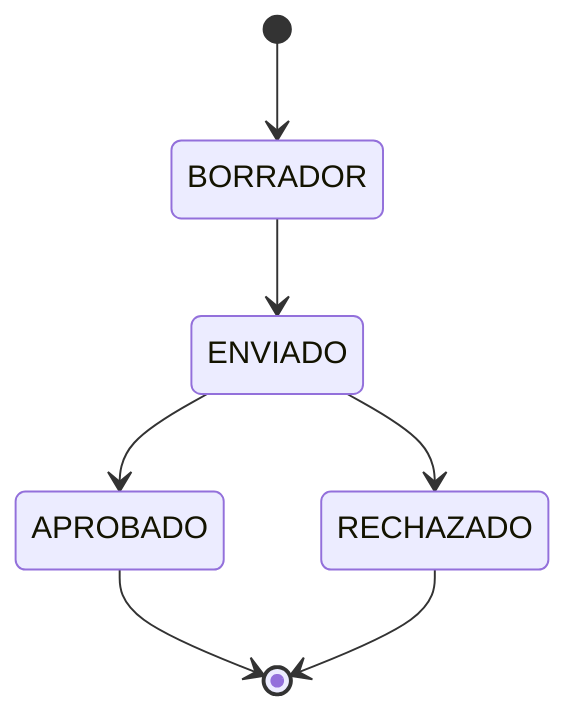

## Overview

The Quotations API manages customer quotations (budgets) with multi-item line support, status workflows, file attachments, and conversion to work orders.

## GET /quotations

Retrieve all quotations with optional filtering.

### Authentication
**Required**: JWT Bearer token

### Query Parameters

<ParamField query="status" type="QuotationStatus">
  Filter by status. Values: `BORRADOR`, `ENVIADO`, `APROBADO`, `RECHAZADO`.
</ParamField>

<ParamField query="clientId" type="string">
  Filter by client ID.
</ParamField>

<ParamField query="search" type="string">
  Search by code, title, or description.
</ParamField>

### Response

Returns an array of quotation objects.

<ResponseField name="id" type="string">
  Quotation's unique identifier (CUID).
</ResponseField>

<ResponseField name="code" type="string">
  Human-readable quotation code (e.g., "Q-2026-001").
</ResponseField>

<ResponseField name="title" type="string">
  Quotation title.
</ResponseField>

<ResponseField name="description" type="string">
  Detailed description.
</ResponseField>

<ResponseField name="status" type="QuotationStatus">
  Current status: `BORRADOR`, `ENVIADO`, `APROBADO`, `RECHAZADO`.
</ResponseField>

<ResponseField name="estimatedTimeMin" type="number">
  Estimated time in minutes.
</ResponseField>

<ResponseField name="estimatedCost" type="number">
  Estimated total cost (Decimal).
</ResponseField>

<ResponseField name="clientId" type="string">
  Associated client ID.
</ResponseField>

<ResponseField name="client" type="object">
  Client information (expanded).
</ResponseField>

<ResponseField name="items" type="array">
  Array of quotation line items.
</ResponseField>

### Example Request

```bash
curl -X GET "https://api.example.com/quotations?status=APROBADO" \
  -H "Authorization: Bearer YOUR_JWT_TOKEN"
```

### Example Response

```json
[
  {
    "id": "clx1a2b3c4d5e6f7g8h9i0j1",
    "code": "Q-2026-015",
    "title": "Fabricación de estructura metálica",
    "description": "Estructura para galpón industrial 12x8m",
    "status": "APROBADO",
    "estimatedTimeMin": 2400,
    "estimatedCost": 125000.50,
    "estimatedMaterials": "Acero A36, perfiles IPE, chapas",
    "attachmentUrl": "/uploads/quotation-1234567890.pdf",
    "validUntil": "2026-04-15T23:59:59.000Z",
    "approvedAt": "2026-03-10T14:30:00.000Z",
    "clientId": "clx0a1b2c3d4e5f6g7h8i9j0",
    "client": {
      "id": "clx0a1b2c3d4e5f6g7h8i9j0",
      "name": "Constructora del Sur SA"
    },
    "items": [
      {
        "id": "clx1x2y3z4a5b6c7d8e9f0g1",
        "description": "Estructura principal",
        "quantity": 1.0,
        "unit": "unidad",
        "estimatedUnitCost": 100000.0,
        "estimatedHoursMin": 1800
      },
      {
        "id": "clx2x3y4z5a6b7c8d9e0f1g2",
        "description": "Refuerzos laterales",
        "quantity": 8.0,
        "unit": "unidad",
        "estimatedUnitCost": 3125.0,
        "estimatedHoursMin": 600
      }
    ],
    "createdAt": "2026-03-01T09:00:00.000Z",
    "updatedAt": "2026-03-10T14:30:00.000Z"
  }
]
```

---

## GET /quotations/:id

Retrieve a specific quotation with all details.

### Authentication
**Required**: JWT Bearer token

### Path Parameters

<ParamField path="id" type="string" required>
  Quotation ID to retrieve.
</ParamField>

### Response

Returns a complete quotation object with all items and relations.

### Example Request

```bash
curl -X GET https://api.example.com/quotations/clx1a2b3c4d5e6f7g8h9i0j1 \
  -H "Authorization: Bearer YOUR_JWT_TOKEN"
```

---

## POST /quotations

Create a new quotation.

### Authentication
**Required**: JWT Bearer token  
**Roles**: `DUENO`, `SUPERVISOR`, `ADMIN`

### Request Body

<ParamField body="clientId" type="string" required>
  Client ID this quotation is for.
</ParamField>

<ParamField body="code" type="string" required>
  Unique quotation code (e.g., "Q-2026-016").
</ParamField>

<ParamField body="title" type="string" required>
  Quotation title.
</ParamField>

<ParamField body="description" type="string" required>
  Detailed description of the work.
</ParamField>

<ParamField body="estimatedTimeMin" type="number" required>
  Estimated time in minutes. Minimum: 0.
</ParamField>

<ParamField body="estimatedCost" type="number" required>
  Total estimated cost. Minimum: 0.
</ParamField>

<ParamField body="estimatedMaterials" type="string">
  Description of materials needed.
</ParamField>

<ParamField body="status" type="QuotationStatus">
  Initial status. Default: `BORRADOR`.
</ParamField>

<ParamField body="approvedAt" type="string">
  ISO 8601 date when approved (if status is APROBADO).
</ParamField>

<ParamField body="validUntil" type="string">
  ISO 8601 date for quotation expiration.
</ParamField>

<ParamField body="items" type="array" required>
  Array of quotation line items. At least one item required.
  
  <ParamField body="description" type="string" required>
    Item description.
  </ParamField>
  
  <ParamField body="quantity" type="number" required>
    Quantity. Minimum: 0.001.
  </ParamField>
  
  <ParamField body="unit" type="string" required>
    Unit of measure (e.g., "kg", "m", "unidad").
  </ParamField>
  
  <ParamField body="estimatedUnitCost" type="number" required>
    Cost per unit. Minimum: 0.
  </ParamField>
  
  <ParamField body="estimatedHoursMin" type="number">
    Estimated hours for this item in minutes. Minimum: 0.
  </ParamField>
</ParamField>

### Response

Returns the created quotation with all items.

### Example Request

```bash
curl -X POST https://api.example.com/quotations \
  -H "Authorization: Bearer YOUR_JWT_TOKEN" \
  -H "Content-Type: application/json" \
  -d '{
    "clientId": "clx0a1b2c3d4e5f6g7h8i9j0",
    "code": "Q-2026-016",
    "title": "Mantenimiento de maquinaria",
    "description": "Revisión general y reemplazo de componentes",
    "estimatedTimeMin": 480,
    "estimatedCost": 35000,
    "estimatedMaterials": "Rodamientos, correas, lubricantes",
    "validUntil": "2026-04-30T23:59:59.000Z",
    "items": [
      {
        "description": "Mano de obra especializada",
        "quantity": 8,
        "unit": "horas",
        "estimatedUnitCost": 3500,
        "estimatedHoursMin": 480
      },
      {
        "description": "Kit de rodamientos",
        "quantity": 2,
        "unit": "kit",
        "estimatedUnitCost": 4500,
        "estimatedHoursMin": 0
      }
    ]
  }'
```

### Example Response

```json
{
  "id": "clx3c4d5e6f7g8h9i0j1k2l3",
  "code": "Q-2026-016",
  "title": "Mantenimiento de maquinaria",
  "description": "Revisión general y reemplazo de componentes",
  "status": "BORRADOR",
  "estimatedTimeMin": 480,
  "estimatedCost": 35000,
  "estimatedMaterials": "Rodamientos, correas, lubricantes",
  "validUntil": "2026-04-30T23:59:59.000Z",
  "clientId": "clx0a1b2c3d4e5f6g7h8i9j0",
  "createdByUserId": "clx1a2b3c4d5e6f7g8h9i0j1",
  "items": [
    {
      "id": "clx4d5e6f7g8h9i0j1k2l3m4",
      "description": "Mano de obra especializada",
      "quantity": 8.0,
      "unit": "horas",
      "estimatedUnitCost": 3500.0,
      "estimatedHoursMin": 480,
      "position": 0
    },
    {
      "id": "clx5e6f7g8h9i0j1k2l3m4n5",
      "description": "Kit de rodamientos",
      "quantity": 2.0,
      "unit": "kit",
      "estimatedUnitCost": 4500.0,
      "estimatedHoursMin": 0,
      "position": 1
    }
  ],
  "createdAt": "2026-03-13T18:00:00.000Z",
  "updatedAt": "2026-03-13T18:00:00.000Z"
}
```

### TypeScript Interfaces

```typescript
interface QuotationItemInputDto {
  description: string;
  quantity: number;           // Minimum 0.001
  unit: string;
  estimatedUnitCost: number;  // Minimum 0
  estimatedHoursMin?: number; // Optional, minimum 0
}

interface CreateQuotationDto {
  clientId: string;
  code: string;
  title: string;
  description: string;
  estimatedTimeMin: number;   // Minimum 0
  estimatedCost: number;      // Minimum 0
  estimatedMaterials?: string;
  status?: 'BORRADOR' | 'ENVIADO' | 'APROBADO' | 'RECHAZADO';
  approvedAt?: string;        // ISO 8601 date
  validUntil?: string;        // ISO 8601 date
  items: QuotationItemInputDto[];
}
```

---

## PATCH /quotations/:id

Update an existing quotation.

### Authentication
**Required**: JWT Bearer token  
**Roles**: `DUENO`, `SUPERVISOR`, `ADMIN`

### Path Parameters

<ParamField path="id" type="string" required>
  Quotation ID to update.
</ParamField>

### Request Body

All fields from `CreateQuotationDto` are optional. Partial updates supported.

### Example Request

```bash
curl -X PATCH https://api.example.com/quotations/clx3c4d5e6f7g8h9i0j1k2l3 \
  -H "Authorization: Bearer YOUR_JWT_TOKEN" \
  -H "Content-Type: application/json" \
  -d '{
    "estimatedCost": 38500,
    "estimatedMaterials": "Rodamientos SKF, correas Gates, lubricante Shell"
  }'
```

---

## PATCH /quotations/:id/status

Update quotation status (workflow transition).

### Authentication
**Required**: JWT Bearer token  
**Roles**: `DUENO`, `SUPERVISOR`, `ADMIN`

### Path Parameters

<ParamField path="id" type="string" required>
  Quotation ID.
</ParamField>

### Request Body

<ParamField body="status" type="QuotationStatus" required>
  New status. Values: `BORRADOR`, `ENVIADO`, `APROBADO`, `RECHAZADO`.
</ParamField>

### Response

Returns the updated quotation.

### Example Request

```bash
curl -X PATCH https://api.example.com/quotations/clx3c4d5e6f7g8h9i0j1k2l3/status \
  -H "Authorization: Bearer YOUR_JWT_TOKEN" \
  -H "Content-Type: application/json" \
  -d '{
    "status": "ENVIADO"
  }'
```

### Example Response

```json
{
  "id": "clx3c4d5e6f7g8h9i0j1k2l3",
  "code": "Q-2026-016",
  "status": "ENVIADO",
  "updatedAt": "2026-03-13T18:30:00.000Z"
}
```

### Status Workflow



---

## POST /quotations/:id/attachment

Upload a file attachment (PDF, images, etc.).

### Authentication
**Required**: JWT Bearer token  
**Roles**: `DUENO`, `SUPERVISOR`, `ADMIN`

### Path Parameters

<ParamField path="id" type="string" required>
  Quotation ID.
</ParamField>

### Request Body

Multipart form data with file upload.

<ParamField body="file" type="file" required>
  File to upload. Maximum size: 10 MB.
</ParamField>

### Response

<ResponseField name="attachmentUrl" type="string">
  Relative URL to the uploaded file.
</ResponseField>

### Example Request

```bash
curl -X POST https://api.example.com/quotations/clx3c4d5e6f7g8h9i0j1k2l3/attachment \
  -H "Authorization: Bearer YOUR_JWT_TOKEN" \
  -F "file=@/path/to/quotation.pdf"
```

### Example Response

```json
{
  "id": "clx3c4d5e6f7g8h9i0j1k2l3",
  "attachmentUrl": "/uploads/file-1710342000123-987654321.pdf",
  "updatedAt": "2026-03-13T19:00:00.000Z"
}
```

---

## DELETE /quotations/:id/attachment

Remove the file attachment from a quotation.

### Authentication
**Required**: JWT Bearer token  
**Roles**: `DUENO`, `SUPERVISOR`, `ADMIN`

### Path Parameters

<ParamField path="id" type="string" required>
  Quotation ID.
</ParamField>

### Example Request

```bash
curl -X DELETE https://api.example.com/quotations/clx3c4d5e6f7g8h9i0j1k2l3/attachment \
  -H "Authorization: Bearer YOUR_JWT_TOKEN"
```

### Example Response

```json
{
  "id": "clx3c4d5e6f7g8h9i0j1k2l3",
  "attachmentUrl": null,
  "updatedAt": "2026-03-13T19:15:00.000Z"
}
```

---

## DELETE /quotations/:id

Delete a quotation.

### Authentication
**Required**: JWT Bearer token  
**Roles**: `DUENO`, `SUPERVISOR`, `ADMIN`

### Path Parameters

<ParamField path="id" type="string" required>
  Quotation ID to delete.
</ParamField>

### Example Request

```bash
curl -X DELETE https://api.example.com/quotations/clx3c4d5e6f7g8h9i0j1k2l3 \
  -H "Authorization: Bearer YOUR_JWT_TOKEN"
```

### Example Response

```json
{
  "success": true,
  "message": "Quotation deleted successfully"
}
```

---

## GET /quotations/status

Check the quotations service health status.

### Authentication
No authentication required.

### Example Response

```json
{
  "status": "ok",
  "service": "quotations"
}
```

## Quotation Statuses

| Status | Description | Next States |
|--------|-------------|-------------|
| `BORRADOR` | Draft quotation | `ENVIADO` |
| `ENVIADO` | Sent to client | `APROBADO`, `RECHAZADO` |
| `APROBADO` | Approved by client | Can create Work Order |
| `RECHAZADO` | Rejected by client | Final state |