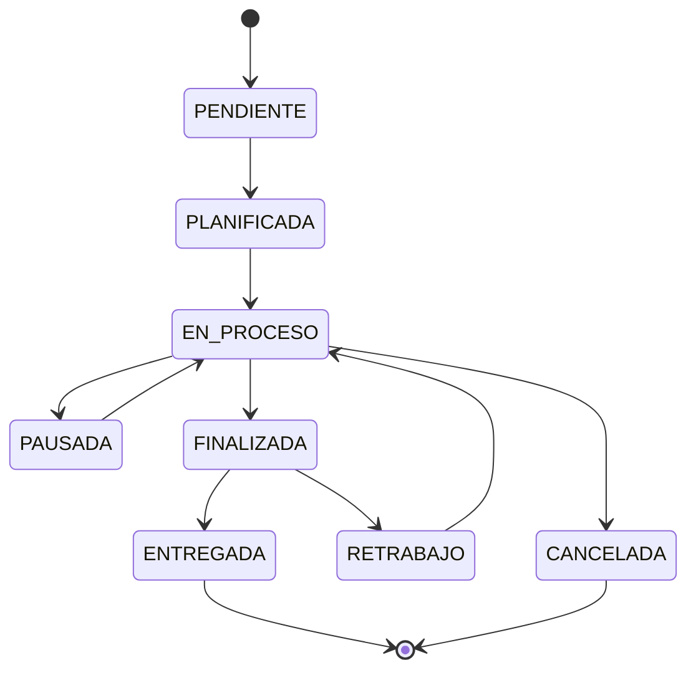

## Overview

The Work Orders API is the core operational module for tracking production jobs. It supports status workflows, resource/user assignments, operation events, material consumption tracking, and delivery management.

## GET /work-orders

Retrieve all work orders with filtering options.

### Authentication
**Required**: JWT Bearer token

### Query Parameters

<ParamField query="status" type="WorkOrderStatus">
  Filter by status. Values: `PENDIENTE`, `PLANIFICADA`, `EN_PROCESO`, `PAUSADA`, `FINALIZADA`, `ENTREGADA`, `CANCELADA`, `RETRABAJO`.
</ParamField>

<ParamField query="search" type="string">
  Search by code, title, or description.
</ParamField>

<ParamField query="assignedToMe" type="string">
  Filter work orders assigned to current user. Values: `true`, `false`.
</ParamField>

### Response

Returns an array of work order objects.

### Example Request

```bash
curl -X GET "https://api.example.com/work-orders?status=EN_PROCESO&assignedToMe=true" \
  -H "Authorization: Bearer YOUR_JWT_TOKEN"
```

### Example Response

```json
[
  {
    "id": "clx1a2b3c4d5e6f7g8h9i0j1",
    "code": "OT-2026-045",
    "title": "Fabricación estructura metálica",
    "description": "Estructura para galpón 12x8m según plano adjunto",
    "status": "EN_PROCESO",
    "priority": 2,
    "estimatedTimeMin": 2400,
    "estimatedCost": 125000.50,
    "plannedDate": "2026-03-15T08:00:00.000Z",
    "commitmentDate": "2026-03-20T18:00:00.000Z",
    "startedAt": "2026-03-15T08:30:00.000Z",
    "clientId": "clx0a1b2c3d4e5f6g7h8i9j0",
    "quotationId": "clx1a2b3c4d5e6f7g8h9i0j1",
    "client": {
      "id": "clx0a1b2c3d4e5f6g7h8i9j0",
      "name": "Constructora del Sur SA"
    },
    "assignments": [
      {
        "id": "clx2x3y4z5a6b7c8d9e0f1g2",
        "resourceId": "clx3c4d5e6f7g8h9i0j1k2l3",
        "userId": "clx4d5e6f7g8h9i0j1k2l3m4",
        "resource": {
          "name": "Soldadora MIG 250A",
          "type": "MAQUINA"
        },
        "user": {
          "fullName": "Carlos Rodríguez",
          "role": "OPERARIO"
        }
      }
    ],
    "createdAt": "2026-03-10T10:00:00.000Z",
    "updatedAt": "2026-03-15T08:30:00.000Z"
  }
]
```

---

## GET /work-orders/:id

Retrieve a specific work order with complete details.

### Authentication
**Required**: JWT Bearer token

### Path Parameters

<ParamField path="id" type="string" required>
  Work order ID.
</ParamField>

### Response

Returns complete work order with assignments, events, and consumptions.

<ResponseField name="operationLogs" type="array">
  Array of operation events (start, pause, resume, etc.).
</ResponseField>

<ResponseField name="materialConsumptions" type="array">
  Array of materials consumed during production.
</ResponseField>

### Example Request

```bash
curl -X GET https://api.example.com/work-orders/clx1a2b3c4d5e6f7g8h9i0j1 \
  -H "Authorization: Bearer YOUR_JWT_TOKEN"
```

---

## POST /work-orders/from-quotation/:quotationId

Create a work order from an approved quotation.

### Authentication
**Required**: JWT Bearer token  
**Roles**: `DUENO`, `SUPERVISOR`, `ADMIN`

### Path Parameters

<ParamField path="quotationId" type="string" required>
  Approved quotation ID to convert.
</ParamField>

### Request Body

<ParamField body="code" type="string" required>
  Work order code (e.g., "OT-2026-046").
</ParamField>

<ParamField body="commitmentDate" type="string">
  ISO 8601 date for delivery commitment.
</ParamField>

### Response

Returns the created work order.

### Example Request

```bash
curl -X POST https://api.example.com/work-orders/from-quotation/clx1a2b3c4d5e6f7g8h9i0j1 \
  -H "Authorization: Bearer YOUR_JWT_TOKEN" \
  -H "Content-Type: application/json" \
  -d '{
    "code": "OT-2026-046",
    "commitmentDate": "2026-03-25T18:00:00.000Z"
  }'
```

---

## POST /work-orders

Create a new work order manually (without quotation).

### Authentication
**Required**: JWT Bearer token  
**Roles**: `DUENO`, `SUPERVISOR`, `ADMIN`

### Request Body

<ParamField body="code" type="string" required>
  Unique work order code (e.g., "OT-2026-047").
</ParamField>

<ParamField body="title" type="string" required>
  Work order title.
</ParamField>

<ParamField body="description" type="string" required>
  Detailed description of the work.
</ParamField>

<ParamField body="clientId" type="string" required>
  Client ID.
</ParamField>

<ParamField body="quotationId" type="string">
  Optional quotation reference.
</ParamField>

<ParamField body="priority" type="number" required>
  Priority level. Range: 1 (highest) to 5 (lowest).
</ParamField>

<ParamField body="plannedDate" type="string">
  ISO 8601 date for planned start.
</ParamField>

<ParamField body="commitmentDate" type="string">
  ISO 8601 date for delivery commitment.
</ParamField>

<ParamField body="estimatedTimeMin" type="number" required>
  Estimated time in minutes. Minimum: 0.
</ParamField>

<ParamField body="estimatedCost" type="number" required>
  Estimated cost. Minimum: 0.
</ParamField>

<ParamField body="notes" type="string">
  Additional notes.
</ParamField>

<ParamField body="dashboardUrl" type="string">
  URL to external dashboard (e.g., Grafana).
</ParamField>

### Example Request

```bash
curl -X POST https://api.example.com/work-orders \
  -H "Authorization: Bearer YOUR_JWT_TOKEN" \
  -H "Content-Type: application/json" \
  -d '{
    "code": "OT-2026-047",
    "title": "Reparación urgente prensa hidráulica",
    "description": "Reemplazo de sello hidráulico y revisión general",
    "clientId": "clx0a1b2c3d4e5f6g7h8i9j0",
    "priority": 1,
    "commitmentDate": "2026-03-14T17:00:00.000Z",
    "estimatedTimeMin": 240,
    "estimatedCost": 15000,
    "notes": "Cliente requiere urgente - parada de producción"
  }'
```

### TypeScript Interface

```typescript
interface CreateWorkOrderDto {
  code: string;
  title: string;
  description: string;
  clientId: string;
  quotationId?: string;
  priority: number;           // 1-5
  plannedDate?: string;       // ISO 8601
  commitmentDate?: string;    // ISO 8601
  estimatedTimeMin: number;   // Minimum 0
  estimatedCost: number;      // Minimum 0
  notes?: string;
  dashboardUrl?: string;
}
```

---

## PATCH /work-orders/:id

Update work order details.

### Authentication
**Required**: JWT Bearer token  
**Roles**: `DUENO`, `SUPERVISOR`, `ADMIN`

### Path Parameters

<ParamField path="id" type="string" required>
  Work order ID.
</ParamField>

### Request Body

All fields from `CreateWorkOrderDto` are optional. Partial updates supported.

---

## POST /work-orders/:id/assignments

Assign a resource and optionally a user to a work order.

### Authentication
**Required**: JWT Bearer token  
**Roles**: `DUENO`, `SUPERVISOR`, `ADMIN`

### Path Parameters

<ParamField path="id" type="string" required>
  Work order ID.
</ParamField>

### Request Body

<ParamField body="resourceId" type="string" required>
  Resource (machine or human) to assign.
</ParamField>

<ParamField body="userId" type="string">
  Specific user to assign (optional).
</ParamField>

### Example Request

```bash
curl -X POST https://api.example.com/work-orders/clx1a2b3c4d5e6f7g8h9i0j1/assignments \
  -H "Authorization: Bearer YOUR_JWT_TOKEN" \
  -H "Content-Type: application/json" \
  -d '{
    "resourceId": "clx3c4d5e6f7g8h9i0j1k2l3",
    "userId": "clx4d5e6f7g8h9i0j1k2l3m4"
  }'
```

### Example Response

```json
{
  "id": "clx5e6f7g8h9i0j1k2l3m4n5",
  "workOrderId": "clx1a2b3c4d5e6f7g8h9i0j1",
  "resourceId": "clx3c4d5e6f7g8h9i0j1k2l3",
  "userId": "clx4d5e6f7g8h9i0j1k2l3m4",
  "assignedAt": "2026-03-15T09:00:00.000Z"
}
```

---

## PATCH /work-orders/:id/status

Change work order status (workflow transition).

### Authentication
**Required**: JWT Bearer token  
**Roles**: `DUENO`, `SUPERVISOR`, `ADMIN`, `OPERARIO`

### Path Parameters

<ParamField path="id" type="string" required>
  Work order ID.
</ParamField>

### Request Body

<ParamField body="status" type="WorkOrderStatus" required>
  New status. Values: `PENDIENTE`, `PLANIFICADA`, `EN_PROCESO`, `PAUSADA`, `FINALIZADA`, `ENTREGADA`, `CANCELADA`, `RETRABAJO`.
</ParamField>

<ParamField body="note" type="string">
  Optional note explaining the status change.
</ParamField>

### Example Request

```bash
curl -X PATCH https://api.example.com/work-orders/clx1a2b3c4d5e6f7g8h9i0j1/status \
  -H "Authorization: Bearer YOUR_JWT_TOKEN" \
  -H "Content-Type: application/json" \
  -d '{
    "status": "PAUSADA",
    "note": "Esperando material - acero IPE 200"
  }'
```

### Status Workflow



---

## POST /work-orders/:id/events

Add an operation event (start, pause, resume, etc.).

### Authentication
**Required**: JWT Bearer token  
**Roles**: `DUENO`, `SUPERVISOR`, `ADMIN`, `OPERARIO`

### Path Parameters

<ParamField path="id" type="string" required>
  Work order ID.
</ParamField>

### Request Body

<ParamField body="eventType" type="OperationEventType" required>
  Event type. Values: `OT_CREADA`, `ASIGNADO`, `INICIO`, `PAUSA`, `REANUDACION`, `FINALIZACION`, `CAMBIO_ESTADO`, `MATERIAL_CONSUMIDO`, `NOTA`.
</ParamField>

<ParamField body="resourceId" type="string">
  Resource involved in the event.
</ParamField>

<ParamField body="pauseReason" type="string">
  Reason for pause (required if eventType is `PAUSA`).
</ParamField>

<ParamField body="note" type="string">
  Additional note.
</ParamField>

### Example Request

```bash
curl -X POST https://api.example.com/work-orders/clx1a2b3c4d5e6f7g8h9i0j1/events \
  -H "Authorization: Bearer YOUR_JWT_TOKEN" \
  -H "Content-Type: application/json" \
  -d '{
    "eventType": "PAUSA",
    "resourceId": "clx3c4d5e6f7g8h9i0j1k2l3",
    "pauseReason": "Falta de material",
    "note": "Esperando entrega de acero IPE 200"
  }'
```

### Example Response

```json
{
  "id": "clx6f7g8h9i0j1k2l3m4n5o6",
  "workOrderId": "clx1a2b3c4d5e6f7g8h9i0j1",
  "eventType": "PAUSA",
  "resourceId": "clx3c4d5e6f7g8h9i0j1k2l3",
  "userId": "clx4d5e6f7g8h9i0j1k2l3m4",
  "pauseReason": "Falta de material",
  "note": "Esperando entrega de acero IPE 200",
  "eventAt": "2026-03-15T11:30:00.000Z",
  "createdAt": "2026-03-15T11:30:00.000Z"
}
```

### TypeScript Interface

```typescript
type OperationEventType = 
  | 'OT_CREADA'
  | 'ASIGNADO'
  | 'INICIO'
  | 'PAUSA'
  | 'REANUDACION'
  | 'FINALIZACION'
  | 'CAMBIO_ESTADO'
  | 'MATERIAL_CONSUMIDO'
  | 'NOTA';

interface AddEventDto {
  eventType: OperationEventType;
  resourceId?: string;
  pauseReason?: string;
  note?: string;
}
```

---

## POST /work-orders/:id/consumptions

Record material consumption for a work order.

### Authentication
**Required**: JWT Bearer token  
**Roles**: `DUENO`, `SUPERVISOR`, `ADMIN`, `OPERARIO`

### Path Parameters

<ParamField path="id" type="string" required>
  Work order ID.
</ParamField>

### Request Body

<ParamField body="materialId" type="string" required>
  Material ID being consumed.
</ParamField>

<ParamField body="quantity" type="number" required>
  Quantity consumed. Minimum: 0.001.
</ParamField>

<ParamField body="note" type="string">
  Optional note about the consumption.
</ParamField>

### Example Request

```bash
curl -X POST https://api.example.com/work-orders/clx1a2b3c4d5e6f7g8h9i0j1/consumptions \
  -H "Authorization: Bearer YOUR_JWT_TOKEN" \
  -H "Content-Type: application/json" \
  -d '{
    "materialId": "clx7g8h9i0j1k2l3m4n5o6p7",
    "quantity": 125.5,
    "note": "Consumo para estructura principal"
  }'
```

### Example Response

```json
{
  "id": "clx8h9i0j1k2l3m4n5o6p7q8",
  "workOrderId": "clx1a2b3c4d5e6f7g8h9i0j1",
  "materialId": "clx7g8h9i0j1k2l3m4n5o6p7",
  "quantity": 125.5,
  "unitCostSnapshot": 850.00,
  "note": "Consumo para estructura principal",
  "consumedAt": "2026-03-15T12:00:00.000Z",
  "createdByUserId": "clx4d5e6f7g8h9i0j1k2l3m4",
  "material": {
    "name": "Perfil IPE 200",
    "unit": "kg"
  }
}
```

---

## POST /work-orders/:id/close-delivery

Close delivery for a work order (mark as delivered).

### Authentication
**Required**: JWT Bearer token  
**Roles**: `DUENO`, `SUPERVISOR`, `ADMIN`

### Path Parameters

<ParamField path="id" type="string" required>
  Work order ID.
</ParamField>

### Request Body

<ParamField body="deliveredAt" type="string">
  ISO 8601 delivery timestamp. Defaults to now.
</ParamField>

<ParamField body="deliveryChecklist" type="string">
  Delivery checklist items. Maximum length: 300 characters.
</ParamField>

<ParamField body="deliveryNote" type="string">
  Delivery notes. Maximum length: 500 characters.
</ParamField>

<ParamField body="isSigned" type="boolean">
  Whether delivery was signed by client.
</ParamField>

### Example Request

```bash
curl -X POST https://api.example.com/work-orders/clx1a2b3c4d5e6f7g8h9i0j1/close-delivery \
  -H "Authorization: Bearer YOUR_JWT_TOKEN" \
  -H "Content-Type: application/json" \
  -d '{
    "deliveredAt": "2026-03-20T16:30:00.000Z",
    "deliveryChecklist": "Estructura montada, pintura aplicada, documentación entregada",
    "deliveryNote": "Cliente conforme, firma en remito adjunto",
    "isSigned": true
  }'
```

---

## POST /work-orders/:id/attachment

Add attachment URL (e.g., signed delivery receipt).

### Authentication
**Required**: JWT Bearer token  
**Roles**: `DUENO`, `SUPERVISOR`, `ADMIN`

### Path Parameters

<ParamField path="id" type="string" required>
  Work order ID.
</ParamField>

### Request Body

<ParamField body="attachmentUrl" type="string" required>
  URL or path to attachment file.
</ParamField>

---

## DELETE /work-orders/:id/attachment

Remove attachment from work order.

### Authentication
**Required**: JWT Bearer token  
**Roles**: `DUENO`, `SUPERVISOR`, `ADMIN`

---

## DELETE /work-orders/:id

Delete a work order.

### Authentication
**Required**: JWT Bearer token  
**Roles**: `DUENO`, `SUPERVISOR`, `ADMIN`

---

## GET /work-orders/status

Check the work orders service health status.

### Example Response

```json
{
  "status": "ok",
  "service": "work-orders"
}
```

## Work Order Statuses

| Status | Description |
|--------|-------------|
| `PENDIENTE` | Pending, not yet planned |
| `PLANIFICADA` | Planned with schedule |
| `EN_PROCESO` | In progress |
| `PAUSADA` | Paused |
| `FINALIZADA` | Finished production |
| `ENTREGADA` | Delivered to client |
| `CANCELADA` | Cancelled |
| `RETRABAJO` | Rework due to non-conformity |