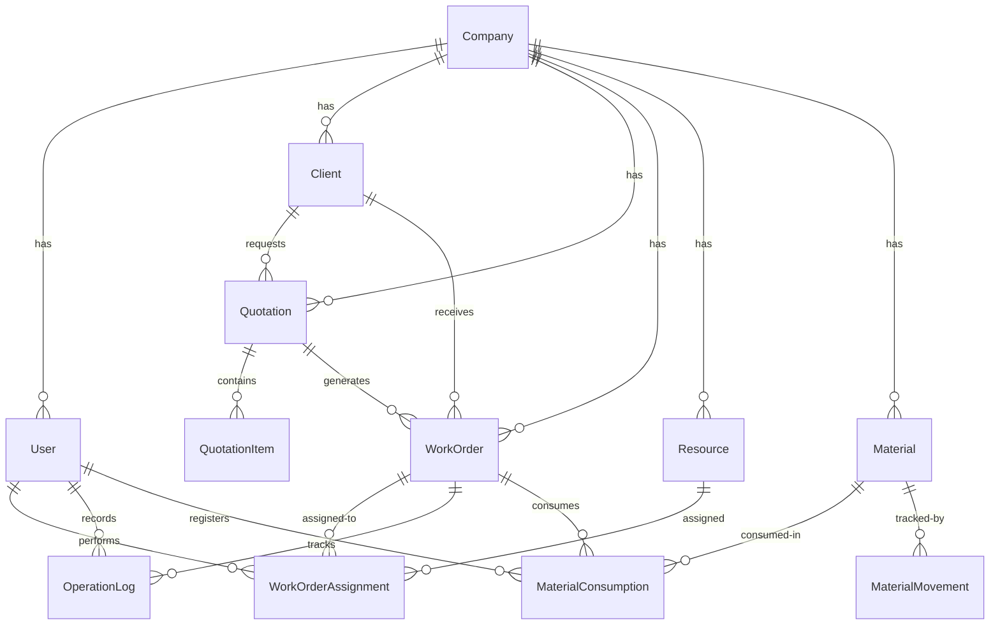

## Overview

DRAIT Mini-MES uses a relational database (PostgreSQL) with Prisma ORM. The schema is designed for multi-tenancy, complete traceability, and efficient querying of production data.

## Entity Relationship Diagram



## Core Entities

### Company (Multi-Tenant Root)

**Purpose**: Represents a workshop or business. All data is isolated by `companyId`.

```prisma
model Company {
  id          String     @id @default(cuid())
  name        String
  legalName   String?
  taxId       String?    // CUIT, tax identifier
  settings    Json?      // Flexible settings (timezone, etc.)
  isActive    Boolean    @default(true)
  createdAt   DateTime   @default(now())
  updatedAt   DateTime   @updatedAt
  
  // Relationships
  users       User[]
  clients     Client[]
  quotations  Quotation[]
  workOrders  WorkOrder[]
  resources   Resource[]
  materials   Material[]
  auditLogs   AuditLog[]
}
```

**Key Points**:
- Every entity has a `companyId` foreign key
- Multi-company deployments isolate data completely
- Soft-delete via `isActive` flag

**Indexes**:
- `@@index([name])` - Fast company lookup

---

### User

**Purpose**: System users with role-based permissions.

```prisma
model User {
  id                   String                @id @default(cuid())
  companyId            String
  email                String
  fullName             String
  passwordHash         String                // bcrypt hashed
  role                 UserRole              // OPERARIO | SUPERVISOR | DUENO | ADMIN
  isActive             Boolean               @default(true)
  createdAt            DateTime              @default(now())
  updatedAt            DateTime              @updatedAt
  
  // Relationships
  company              Company               @relation(fields: [companyId], references: [id], onDelete: Cascade)
  createdQuotations    Quotation[]           @relation("QuotationCreator")
  createdWorkOrders    WorkOrder[]           @relation("WorkOrderCreator")
  closedWorkOrders     WorkOrder[]           @relation("WorkOrderCloser")
  assignments          WorkOrderAssignment[] @relation("WorkOrderUserAssignments")
  materialConsumptions MaterialConsumption[]
  operationLogs        OperationLog[]
  auditLogs            AuditLog[]
  
  @@unique([companyId, email])
  @@index([companyId, role])
}
```

**Authentication**:
- Password stored as bcrypt hash
- JWT token contains `{ sub: userId, companyId, role, email, fullName }`
- Email unique per company (multi-tenant support)

**User Roles**:
```prisma
enum UserRole {
  DUENO      // Owner - full access
  SUPERVISOR // Manager - operational access
  OPERARIO   // Operator - execution only
  ADMIN      // Admin - technical access
}
```

**Indexes**:
- `@@unique([companyId, email])` - Enforce email uniqueness per company
- `@@index([companyId, role])` - Filter users by role

---

### Client

**Purpose**: External customers who request work.

```prisma
model Client {
  id         String      @id @default(cuid())
  companyId  String
  name       String
  contact    String?     // Contact person name
  phone      String?
  email      String?
  address    String?
  notes      String?     // Special requirements, payment terms, etc.
  isActive   Boolean     @default(true)
  createdAt  DateTime    @default(now())
  updatedAt  DateTime    @updatedAt
  
  // Relationships
  company    Company     @relation(fields: [companyId], references: [id], onDelete: Cascade)
  quotations Quotation[]
  workOrders WorkOrder[]
  
  @@index([companyId, name])
  @@index([companyId, isActive])
}
```

**Soft Delete**: Setting `isActive = false` hides client from active lists but preserves history.

**Indexes**:
- `@@index([companyId, name])` - Search clients by name
- `@@index([companyId, isActive])` - Filter active clients

---

### Quotation

**Purpose**: Price estimates sent to clients before work begins.

```prisma
model Quotation {
  id                 String          @id @default(cuid())
  companyId          String
  clientId           String
  createdByUserId    String?
  code               String          // "Q-2026-001"
  title              String
  description        String
  estimatedTimeMin   Int             // Total estimated minutes
  estimatedCost      Decimal         @db.Decimal(12, 2)
  estimatedMaterials String?         // Text description of materials needed
  attachmentUrl      String?         // Link to detailed quote document
  status             QuotationStatus @default(BORRADOR)
  approvedAt         DateTime?
  validUntil         DateTime?       // Expiration date
  createdAt          DateTime        @default(now())
  updatedAt          DateTime        @updatedAt
  
  // Relationships
  company            Company         @relation(fields: [companyId], references: [id], onDelete: Cascade)
  client             Client          @relation(fields: [clientId], references: [id], onDelete: Restrict)
  createdByUser      User?           @relation("QuotationCreator", fields: [createdByUserId], references: [id], onDelete: SetNull)
  items              QuotationItem[]
  workOrders         WorkOrder[]     // Orders generated from this quote
  
  @@unique([companyId, code])
  @@index([companyId, status])
}
```

**Quotation Status**:
```prisma
enum QuotationStatus {
  BORRADOR   // Draft - work in progress
  ENVIADO    // Sent to client
  APROBADO   // Approved - ready to convert to work order
  RECHAZADO  // Rejected by client
}
```

**Cascade Behavior**:
- `onDelete: Restrict` on `clientId` - Cannot delete client with quotations
- `onDelete: SetNull` on `createdByUserId` - If user deleted, preserve quotation

**Indexes**:
- `@@unique([companyId, code])` - Unique quotation codes per company
- `@@index([companyId, status])` - Filter by approval status

---

### QuotationItem

**Purpose**: Line items within a quotation (materials, labor, services).

```prisma
model QuotationItem {
  id                String    @id @default(cuid())
  quotationId       String
  description       String    // "Welding 10m steel beam"
  quantity          Decimal   @db.Decimal(12, 3)
  unit              String    // "m", "kg", "hours", "units"
  estimatedUnitCost Decimal   @db.Decimal(12, 2)
  estimatedHoursMin Int?      // Time estimate for this item
  position          Int       @default(0)  // Display order
  createdAt         DateTime  @default(now())
  updatedAt         DateTime  @updatedAt
  
  quotation         Quotation @relation(fields: [quotationId], references: [id], onDelete: Cascade)
  
  @@index([quotationId, position])
}
```

**Calculated Fields**:
- Line total = `quantity × estimatedUnitCost`
- Quotation total = Σ(all item line totals)

**Cascade**: Deleting quotation deletes all items.

---

### WorkOrder (Core Production Entity)

**Purpose**: Active production job tracking time, costs, and status.

```prisma
model WorkOrder {
  id                   String               @id @default(cuid())
  companyId            String
  clientId             String
  quotationId          String?              // Linked quote (if converted)
  createdByUserId      String?
  code                 String               // "OT-2026-001"
  title                String
  description          String
  status               WorkOrderStatus      @default(PENDIENTE)
  priority             Int                  @default(3)  // 1=high, 5=low
  plannedDate          DateTime?
  commitmentDate       DateTime?            // Promised delivery date
  startedAt            DateTime?
  finishedAt           DateTime?
  deliveredAt          DateTime?
  closedAt             DateTime?
  closedByUserId       String?
  deliveryChecklist    String?              // Items included in delivery
  deliveryNote         String?              // Special delivery instructions
  notes                String?
  attachmentUrl        String?              // Signed remito/delivery note
  isSigned             Boolean              @default(false)
  dashboardUrl         String?              // External dashboard link
  estimatedTimeMin     Int
  estimatedCost        Decimal              @db.Decimal(12, 2)
  createdAt            DateTime             @default(now())
  updatedAt            DateTime             @updatedAt
  
  // Relationships
  company              Company              @relation(fields: [companyId], references: [id], onDelete: Cascade)
  client               Client               @relation(fields: [clientId], references: [id], onDelete: Restrict)
  quotation            Quotation?           @relation(fields: [quotationId], references: [id], onDelete: SetNull)
  createdByUser        User?                @relation("WorkOrderCreator", fields: [createdByUserId], references: [id], onDelete: SetNull)
  closedByUser         User?                @relation("WorkOrderCloser", fields: [closedByUserId], references: [id], onDelete: SetNull)
  assignments          WorkOrderAssignment[]
  operationLogs        OperationLog[]
  materialConsumptions MaterialConsumption[]
  
  @@unique([companyId, code])
  @@index([companyId, status])
  @@index([companyId, commitmentDate])
}
```

**Work Order Status**:
```prisma
enum WorkOrderStatus {
  PENDIENTE     // Pending - not started
  PLANIFICADA   // Planned - resources assigned
  EN_PROCESO    // In progress - actively working
  PAUSADA       // Paused - temporarily stopped
  FINALIZADA    // Finished - work complete
  ENTREGADA     // Delivered - handed to client
  CANCELADA     // Cancelled
  RETRABAJO     // Rework - quality issue
}
```

**Key Timestamps**:
- `createdAt` - When order entered system
- `startedAt` - When first `INICIO` event occurred
- `finishedAt` - When `FINALIZACION` event occurred
- `deliveredAt` - When delivery closed
- `closedAt` - Final closure timestamp

**Indexes**:
- `@@unique([companyId, code])` - Unique order codes
- `@@index([companyId, status])` - Filter by status
- `@@index([companyId, commitmentDate])` - Find overdue orders

---

### Resource

**Purpose**: Machines and personnel assignable to work orders.

```prisma
model Resource {
  id            String                @id @default(cuid())
  companyId     String
  type          ResourceType          // HUMANO | MAQUINA
  name          String
  sector        String?               // "Welding", "Assembly", etc.
  status        ResourceStatus        @default(DISPONIBLE)
  notes         String?
  isActive      Boolean               @default(true)
  createdAt     DateTime              @default(now())
  updatedAt     DateTime              @updatedAt
  
  company       Company               @relation(fields: [companyId], references: [id], onDelete: Cascade)
  assignments   WorkOrderAssignment[]
  operationLogs OperationLog[]
  
  @@index([companyId, type, isActive])
  @@index([companyId, status])
}
```

**Resource Types**:
```prisma
enum ResourceType {
  HUMANO   // Person (linked to User for operators)
  MAQUINA  // Machine/equipment
}

enum ResourceStatus {
  DISPONIBLE      // Available for work
  OCUPADO         // Currently assigned and busy
  MANTENIMIENTO   // Under maintenance
  FUERA_DE_LINEA  // Offline/broken
}
```

**Usage**:
- `HUMANO` resources often linked to `User` via `WorkOrderAssignment.userId`
- `MAQUINA` resources track equipment utilization

**Indexes**:
- `@@index([companyId, type, isActive])` - Find available humans or machines
- `@@index([companyId, status])` - Check resource availability

---

### WorkOrderAssignment

**Purpose**: Links resources and operators to work orders.

```prisma
model WorkOrderAssignment {
  id           String    @id @default(cuid())
  companyId    String
  workOrderId  String
  resourceId   String    // Machine or human resource
  userId       String?   // If resource is HUMANO, the operator User
  assignedAt   DateTime  @default(now())
  unassignedAt DateTime? // When assignment ended
  createdAt    DateTime  @default(now())
  updatedAt    DateTime  @updatedAt
  
  workOrder    WorkOrder @relation(fields: [workOrderId], references: [id], onDelete: Cascade)
  resource     Resource  @relation(fields: [resourceId], references: [id], onDelete: Restrict)
  user         User?     @relation("WorkOrderUserAssignments", fields: [userId], references: [id], onDelete: SetNull)
  
  @@index([companyId, workOrderId])
  @@index([companyId, resourceId])
}
```

**Assignment Lifecycle**:
1. Created when SUPERVISOR assigns resource to work order
2. Active while `unassignedAt` is null
3. Closed by setting `unassignedAt` when work complete or reassigned

**Queries**:
- Find all work orders for a user: Filter by `userId`
- Find resource utilization: Count active assignments per resource

**Indexes**:
- `@@index([companyId, workOrderId])` - All assignments for an order
- `@@index([companyId, resourceId])` - All assignments for a resource

---

### OperationLog

**Purpose**: Complete traceability of work order events.

```prisma
model OperationLog {
  id          String             @id @default(cuid())
  companyId   String
  workOrderId String
  resourceId  String?            // Machine used (optional)
  userId      String?            // Operator who performed action
  eventType   OperationEventType
  eventAt     DateTime           // When event occurred
  pauseReason String?            // Required if eventType = PAUSA
  note        String?            // Free-text observation
  createdAt   DateTime           @default(now())
  
  workOrder   WorkOrder          @relation(fields: [workOrderId], references: [id], onDelete: Cascade)
  resource    Resource?          @relation(fields: [resourceId], references: [id], onDelete: SetNull)
  user        User?              @relation(fields: [userId], references: [id], onDelete: SetNull)
  
  @@index([companyId, workOrderId, eventAt])
}
```

**Operation Event Types**:
```prisma
enum OperationEventType {
  OT_CREADA           // Order created
  ASIGNADO            // Resource assigned
  INICIO              // Work started
  PAUSA               // Work paused
  REANUDACION         // Work resumed
  FINALIZACION        // Work completed
  CAMBIO_ESTADO       // Status changed
  MATERIAL_CONSUMIDO  // Material consumed
  NOTA                // General note
}
```

**Time Calculations**:
To calculate actual work time:
1. Find all `INICIO` and `FINALIZACION` events
2. Subtract `PAUSA` periods
3. Sum remaining time intervals

**Index**:
- `@@index([companyId, workOrderId, eventAt])` - Chronological event retrieval

---

### Material

**Purpose**: Inventory items consumed in production.

```prisma
model Material {
  id           String                @id @default(cuid())
  companyId    String
  name         String                // "Steel rod 12mm"
  category     String?               // "Metal", "Consumables", etc.
  unit         String                // "kg", "m", "L", "units"
  unitCost     Decimal               @db.Decimal(12, 2)
  stock        Decimal               @default(0) @db.Decimal(12, 3)
  isActive     Boolean               @default(true)
  createdAt    DateTime              @default(now())
  updatedAt    DateTime              @updatedAt
  
  company      Company               @relation(fields: [companyId], references: [id], onDelete: Cascade)
  consumptions MaterialConsumption[]
  movements    MaterialMovement[]
  
  @@index([companyId, name])
  @@index([companyId, isActive])
}
```

**Stock Management**:
- `stock` automatically updated when `MaterialConsumption` or `MaterialMovement` recorded
- Decimal precision supports fractional quantities (e.g., 2.5 kg)

**Indexes**:
- `@@index([companyId, name])` - Search materials
- `@@index([companyId, isActive])` - Filter active materials

---

### MaterialMovement

**Purpose**: Tracks stock changes (purchases, adjustments, consumption).

```prisma
model MaterialMovement {
  id          String               @id @default(cuid())
  companyId   String
  materialId  String
  type        MaterialMovementType
  quantity    Decimal              @db.Decimal(12, 3)  // Positive or negative
  unitCost    Decimal              @db.Decimal(12, 2)  // Cost at time of movement
  note        String?
  createdAt   DateTime             @default(now())
  
  material    Material             @relation(fields: [materialId], references: [id], onDelete: Cascade)
  
  @@index([companyId, materialId, createdAt])
}
```

**Movement Types**:
```prisma
enum MaterialMovementType {
  ENTRADA  // Purchase/receipt (positive quantity)
  AJUSTE   // Manual adjustment (positive or negative)
  CONSUMO  // Work order consumption (negative quantity, auto-created)
}
```

**Flow**:
1. Purchase: `ENTRADA` with positive quantity
2. Work consumption: Creates `CONSUMO` movement automatically
3. Inventory correction: `AJUSTE` to fix discrepancies

**Index**:
- `@@index([companyId, materialId, createdAt])` - Material history timeline

---

### MaterialConsumption

**Purpose**: Links materials to specific work orders with frozen costs.

```prisma
model MaterialConsumption {
  id               String    @id @default(cuid())
  companyId        String
  workOrderId      String
  materialId       String
  createdByUserId  String?   // Operator who registered consumption
  quantity         Decimal   @db.Decimal(12, 3)
  unitCostSnapshot Decimal   @db.Decimal(12, 2)  // Cost at consumption time
  note             String?
  consumedAt       DateTime  @default(now())
  createdAt        DateTime  @default(now())
  
  workOrder        WorkOrder @relation(fields: [workOrderId], references: [id], onDelete: Cascade)
  material         Material  @relation(fields: [materialId], references: [id], onDelete: Restrict)
  createdByUser    User?     @relation(fields: [createdByUserId], references: [id], onDelete: SetNull)
  
  @@index([companyId, workOrderId, consumedAt])
}
```

**Cost Snapshot**:
- `unitCostSnapshot` captures `Material.unitCost` at consumption time
- Prevents cost changes from affecting historical calculations
- Actual cost = `quantity × unitCostSnapshot`

**Cascade**:
- `onDelete: Cascade` on `workOrderId` - Delete consumptions with order
- `onDelete: Restrict` on `materialId` - Cannot delete material if consumed

**Index**:
- `@@index([companyId, workOrderId, consumedAt])` - Consumption timeline per order

---

### AuditLog

**Purpose**: Complete system audit trail for compliance and troubleshooting.

```prisma
model AuditLog {
  id         String          @id @default(cuid())
  companyId  String
  userId     String?         // Who made the change (null for system events)
  entityType AuditEntityType
  entityId   String          // ID of affected entity
  action     AuditActionType
  before     Json?           // State before change
  after      Json?           // State after change
  metadata   Json?           // Additional context
  createdAt  DateTime        @default(now())
  
  company    Company         @relation(fields: [companyId], references: [id], onDelete: Cascade)
  user       User?           @relation(fields: [userId], references: [id], onDelete: SetNull)
  
  @@index([companyId, createdAt])
  @@index([companyId, entityType, entityId])
  @@index([companyId, action])
}
```

**Audit Entity Types**:
```prisma
enum AuditEntityType {
  COMPANY
  USER
  CLIENT
  QUOTATION
  WORK_ORDER
  RESOURCE
  MATERIAL
  AUTH
}
```

**Audit Actions**:
```prisma
enum AuditActionType {
  CREATE
  UPDATE
  DELETE
  STATUS_CHANGE
  ASSIGN
  DELIVERY_CLOSE
  PASSWORD_CHANGE
  ROLE_CHANGE
  SETTINGS_CHANGE
  LOGIN
}
```

**Usage**:
- All sensitive operations automatically create audit logs
- DUEÑO and ADMIN can query logs via `/api/audit-logs`
- Filter by `entityType`, `action`, or date range

**Indexes**:
- `@@index([companyId, createdAt])` - Chronological audit retrieval
- `@@index([companyId, entityType, entityId])` - Entity change history
- `@@index([companyId, action])` - Filter by action type (e.g., all logins)

---

## Relationship Patterns

### Multi-Tenancy

Every entity (except root) has `companyId`:

```prisma
company Company @relation(fields: [companyId], references: [id], onDelete: Cascade)
```

Deleting a company cascades to all owned data.

### Soft Deletes

Entities use `isActive` flag instead of physical deletion:

- `User.isActive = false` - Suspended user
- `Client.isActive = false` - Archived client
- `Resource.isActive = false` - Decommissioned resource
- `Material.isActive = false` - Discontinued material

Preserves referential integrity and history.

### Cascade Behaviors

| Relationship | On Delete | Reason |
|--------------|-----------|--------|
| Company → User | Cascade | Remove all users when company deleted |
| Company → WorkOrder | Cascade | Remove all work orders when company deleted |
| Quotation → QuotationItem | Cascade | Items meaningless without parent quote |
| WorkOrder → OperationLog | Cascade | Events belong to specific order |
| WorkOrder → Assignment | Cascade | Assignments meaningless without order |
| Client → Quotation | Restrict | Cannot delete client with existing quotes |
| Material → Consumption | Restrict | Cannot delete material that's been used |
| User → WorkOrder | SetNull | Preserve order if user deleted |

### Nullable Foreign Keys

Optional relationships use nullable FKs:

- `WorkOrder.quotationId?` - Order can be created without quotation
- `WorkOrder.createdByUserId?` - Preserve order if creator deleted
- `OperationLog.userId?` - Event might be system-generated

## Query Performance

### Index Strategy

All indexes follow pattern `[companyId, ...]` for multi-tenant queries:

```typescript
// Efficient query - uses index
await prisma.workOrder.findMany({
  where: {
    companyId: user.companyId,
    status: 'EN_PROCESO'
  }
});

// Inefficient - missing companyId
await prisma.workOrder.findMany({
  where: { status: 'EN_PROCESO' }  // Slow!
});
```

### Composite Indexes

Multi-column indexes optimize common queries:

- `@@index([companyId, status])` - Filter by status
- `@@index([companyId, workOrderId, eventAt])` - Chronological events
- `@@index([companyId, type, isActive])` - Available resources by type

### Unique Constraints

Prevent duplicates while allowing multi-tenancy:

- `@@unique([companyId, email])` - Email unique per company, not globally
- `@@unique([companyId, code])` - Order codes unique per company

## Data Types

### Decimals for Precision

Financial and quantity fields use `Decimal` type:

```prisma
estimatedCost Decimal @db.Decimal(12, 2)  // 12 digits, 2 decimal places
quantity      Decimal @db.Decimal(12, 3)  // Supports fractional quantities
```

Avoids floating-point rounding errors in cost calculations.

### JSON Fields

Flexible data stored as JSON:

```prisma
Company.settings Json?     // Custom company settings
AuditLog.before  Json?     // State before change
AuditLog.after   Json?     // State after change
AuditLog.metadata Json?    // Additional context
```

Allows schema evolution without migrations for non-critical data.

### Timestamp Fields

Every entity has:

```prisma
createdAt DateTime @default(now())
updatedAt DateTime @updatedAt
```

Automatic audit trail of record lifecycle.

## Best Practices

<Tip>
**Always Filter by companyId**: Every query should include `companyId` in the `where` clause for security and performance.
</Tip>

<Warning>
**Decimal vs Float**: Never use JavaScript `Number` for currency or quantities. Always use Prisma `Decimal` type and `decimal.js` library.
</Warning>

<Tip>
**Use Transactions**: When creating related records (e.g., Quotation + QuotationItems), use Prisma transactions to ensure atomicity.
</Tip>

```typescript
await prisma.$transaction(async (tx) => {
  const quotation = await tx.quotation.create({ data: quoteData });
  await tx.quotationItem.createMany({ 
    data: items.map(item => ({ ...item, quotationId: quotation.id })) 
  });
});
```

## Related Documentation

- [Roles & Permissions](/concepts/roles-permissions) - User entity and role enum
- [Workflow](/concepts/workflow) - How entities interact in production flow
- [API Reference](/api/overview) - Endpoint documentation with entity schemas