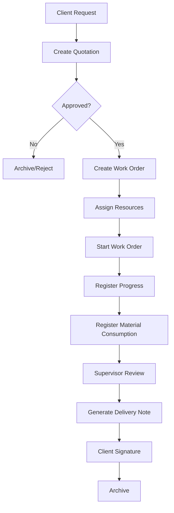

## Overview

DRAIT Mini-MES implements a structured workflow that guides metalworking orders from initial client request through production to final delivery. This workflow ensures traceability, accurate costing, and efficient resource allocation.

## Workflow Stages

The complete production lifecycle consists of 12 stages:



## Stage Details

### 1. Client Request

**Actors**: Client, SUPERVISOR, DUEÑO

**Process**: Client contacts the workshop with a production requirement.

**System Action**: None (external to system)

**Next Step**: Create quotation in the system

---

### 2. Create Quotation

**Actors**: SUPERVISOR, DUEÑO, ADMIN

**API Endpoint**: `POST /api/quotations`

**Required Data**:
- Client information
- Quotation title and description
- Estimated time (minutes)
- Estimated cost
- Quotation items with quantities and unit costs

**Status**: `BORRADOR` (Draft)

```typescript
enum QuotationStatus {
  BORRADOR   // Draft - being prepared
  ENVIADO    // Sent to client
  APROBADO   // Approved by client
  RECHAZADO  // Rejected by client
}
```

**Actions Available**:
- Edit quotation details
- Add/remove quotation items
- Change status to `ENVIADO` when ready to send
- Set validity period (`validUntil`)

---

### 3. Client Approval Decision

**Actors**: Client (external), SUPERVISOR (updates system)

**API Endpoint**: `PATCH /api/quotations/:id/status`

**Outcomes**:
- **Approved**: Status → `APROBADO`, `approvedAt` timestamp set
- **Rejected**: Status → `RECHAZADO`, archived for future reference

**Data Model**:
```prisma
model Quotation {
  id                 String          @id
  status             QuotationStatus
  approvedAt         DateTime?
  validUntil         DateTime?
  items              QuotationItem[]
  workOrders         WorkOrder[]     // Generated from this quotation
}
```

---

### 4. Create Work Order

**Actors**: SUPERVISOR, DUEÑO, ADMIN

**API Endpoints**:
- `POST /api/work-orders/from-quotation/:quotationId` (from approved quotation)
- `POST /api/work-orders` (manual creation)

**Initial Status**: `PENDIENTE` (Pending)

**Work Order States**:
```typescript
enum WorkOrderStatus {
  PENDIENTE     // Pending - not yet planned
  PLANIFICADA   // Planned - resources identified
  EN_PROCESO    // In progress - work started
  PAUSADA       // Paused - temporarily stopped
  FINALIZADA    // Finished - work complete
  ENTREGADA     // Delivered - handed to client
  CANCELADA     // Cancelled
  RETRABAJO     // Rework - quality issue
}
```

**Key Fields**:
- `code`: Unique identifier (e.g., "OT-2026-001")
- `title`, `description`: Work specification
- `priority`: 1 (high) to 5 (low)
- `plannedDate`: When work should start
- `commitmentDate`: Promised delivery date
- `estimatedTimeMin`: Expected duration in minutes
- `estimatedCost`: Budgeted cost

---

### 5. Assign Resources

**Actors**: SUPERVISOR, DUEÑO, ADMIN

**API Endpoint**: `POST /api/work-orders/:id/assignments`

**Process**: Assign human operators and machines to the work order.

**Resources**:
```prisma
enum ResourceType {
  HUMANO   // Person
  MAQUINA  // Machine/equipment
}

enum ResourceStatus {
  DISPONIBLE      // Available
  OCUPADO         // Busy
  MANTENIMIENTO   // Under maintenance
  FUERA_DE_LINEA  // Offline
}
```

**Assignment Record**:
```prisma
model WorkOrderAssignment {
  id           String    @id
  workOrderId  String
  resourceId   String    // Machine or tool
  userId       String?   // Operator (if HUMANO resource)
  assignedAt   DateTime
  unassignedAt DateTime?
}
```

**Status Change**: `PENDIENTE` → `PLANIFICADA`

---

### 6. Start Work Order

**Actors**: OPERARIO, SUPERVISOR, DUEÑO, ADMIN

**API Endpoint**: `POST /api/work-orders/:id/events`

**Event Type**: `INICIO` (Start)

**Process**:
1. Operator views assigned work orders in "My Shift" view
2. Selects work order to start
3. System records start event with timestamp
4. Work order status changes to `EN_PROCESO`
5. Resource status changes to `OCUPADO`

**Operation Events**:
```prisma
enum OperationEventType {
  OT_CREADA           // Work order created
  ASIGNADO            // Resource/operator assigned
  INICIO              // Start
  PAUSA               // Pause
  REANUDACION         // Resume
  FINALIZACION        // Finish
  CAMBIO_ESTADO       // Status change
  MATERIAL_CONSUMIDO  // Material consumed
  NOTA                // Free-form note
}

model OperationLog {
  id          String             @id
  workOrderId String
  resourceId  String?
  userId      String?
  eventType   OperationEventType
  eventAt     DateTime
  pauseReason String?
  note        String?
}
```

**Key Timestamp**: `startedAt` field populated on WorkOrder

---

### 7. Register Progress

**Actors**: OPERARIO, SUPERVISOR, DUEÑO, ADMIN

**API Endpoint**: `POST /api/work-orders/:id/events`

**Available Events**:
- `PAUSA`: Pause work (requires `pauseReason`)
- `REANUDACION`: Resume work after pause
- `NOTA`: Add progress note or comment

**Status Transitions**:
- Active work: `EN_PROCESO`
- Paused: `PAUSADA`
- Resumed: `PAUSADA` → `EN_PROCESO`

**Pause Reasons** (examples):
- "Waiting for material"
- "Machine breakdown"
- "End of shift"
- "Awaiting supervisor inspection"

---

### 8. Register Material Consumption

**Actors**: OPERARIO, SUPERVISOR, DUEÑO, ADMIN

**API Endpoint**: `POST /api/work-orders/:id/consumptions`

**Process**:
1. Operator selects material from catalog
2. Enters quantity consumed
3. System captures current unit cost as `unitCostSnapshot`
4. Material stock automatically decremented
5. Consumption linked to work order for cost tracking

**Data Model**:
```prisma
model MaterialConsumption {
  id               String   @id
  workOrderId      String
  materialId       String
  createdByUserId  String?
  quantity         Decimal  @db.Decimal(12, 3)
  unitCostSnapshot Decimal  @db.Decimal(12, 2)  // Cost frozen at consumption time
  note             String?
  consumedAt       DateTime
}

model Material {
  id           String   @id
  name         String
  category     String?
  unit         String   // "kg", "m", "unit", etc.
  unitCost     Decimal
  stock        Decimal  @default(0)
}
```

**Cost Tracking**: Total material cost = Σ(quantity × unitCostSnapshot) for all consumptions

---

### 9. Supervisor Review

**Actors**: SUPERVISOR, DUEÑO, ADMIN

**Process**:
1. Operator marks work as `FINALIZACION` event
2. Work order status changes to `FINALIZADA`
3. Supervisor reviews:
   - Quality of work
   - Time vs. estimate
   - Material consumption vs. budget
   - Client requirements met

**Key Timestamps**:
- `startedAt`: When work began
- `finishedAt`: When operator completed work

**Quality Control**:
- If quality issue found: Status → `RETRABAJO`
- If approved: Proceed to delivery

---

### 10. Generate Delivery Note (Remito)

**Actors**: SUPERVISOR, DUEÑO, ADMIN

**API Endpoint**: `POST /api/work-orders/:id/close-delivery`

**Required Data**:
- `deliveryChecklist`: Items delivered
- `deliveryNote`: Special instructions or observations
- `attachmentUrl`: URL to signed delivery document

**Process**:
1. Supervisor prepares delivery checklist
2. Documents special conditions or notes
3. System generates delivery record
4. Status changes to `ENTREGADA`

**Data Captured**:
```prisma
model WorkOrder {
  deliveredAt       DateTime?
  closedAt          DateTime?
  closedByUserId    String?
  deliveryChecklist String?
  deliveryNote      String?
  attachmentUrl     String?  // Signed remito
  isSigned          Boolean  @default(false)
}
```

---

### 11. Client Signature

**Actors**: Client (physical), SUPERVISOR (system update)

**API Endpoint**: `POST /api/work-orders/:id/attachment`

**Process**:
1. Client reviews delivered work
2. Signs physical or digital delivery note
3. Supervisor uploads signed document
4. System sets `isSigned` flag to `true`
5. `attachmentUrl` contains document location

**Proof of Delivery**: Signed remito serves as legal proof of work completion and client acceptance.

---

### 12. Archive

**Actors**: System (automatic)

**Process**: Work order remains in `ENTREGADA` status indefinitely for historical reference and reporting.

**Traceability**: Complete history preserved:
- All operation events with timestamps
- Material consumptions with frozen costs
- Resource assignments
- Audit log of all changes

**Reporting**: Closed work orders feed into:
- Financial reports (actual vs. estimated cost)
- Productivity metrics (time per order, operator efficiency)
- Client history (past work, patterns)

---

## Role Responsibilities by Stage

<AccordionGroup>
  <Accordion title="OPERARIO (Operator) Workflow">

**Stages**: 6-8 (Execution phase)

1. View assigned work orders in "My Shift"
2. Start work order (registers `INICIO` event)
3. Register progress:
   - Pause when needed with reason
   - Resume after interruption
   - Add notes about issues or observations
4. Register material consumption as used
5. Complete work (registers `FINALIZACION` event)

**Limited Access**: Cannot create orders, assign resources, or close deliveries.

  </Accordion>
  
  <Accordion title="SUPERVISOR Workflow">

**Stages**: 2-11 (All operational stages)

1. Create quotations for client requests
2. Convert approved quotations to work orders
3. Assign resources and operators to orders
4. Monitor progress in Supervisor Dashboard
5. Review completed work for quality
6. Generate and close delivery notes
7. Upload signed remitos
8. Analyze productivity reports

**Full Operational Control**: Cannot manage users or view audit logs.

  </Accordion>
  
  <Accordion title="DUEÑO/ADMIN Workflow">

**Stages**: All (Complete oversight)

In addition to SUPERVISOR capabilities:
1. Create and manage user accounts
2. View audit logs for compliance
3. Review financial metrics and margins
4. Make strategic decisions based on dashboard KPIs
5. Adjust system settings and permissions

**Strategic Focus**: Business intelligence and system administration.

  </Accordion>
</AccordionGroup>

## Key Metrics Tracked

Throughout the workflow, the system captures:

| Metric | How It's Calculated | Used For |
|--------|---------------------|----------|
| **Actual Time** | Sum of time between `INICIO` and `FINALIZACION` events (excluding pauses) | Productivity analysis, future estimates |
| **Time Deviation** | `actualTime - estimatedTimeMin` | Identifying inefficiencies |
| **Actual Material Cost** | Sum of all `MaterialConsumption.quantity × unitCostSnapshot` | Cost control, margin analysis |
| **Cost Deviation** | `actualCost - estimatedCost` | Profitability tracking |
| **On-Time Delivery** | `deliveredAt <= commitmentDate` | Client satisfaction metric |
| **Work Order Cycle Time** | `deliveredAt - createdAt` | Process efficiency |

## Workflow Variations

### Rush Orders

For urgent work:
1. Skip quotation, create work order directly
2. Set `priority = 1` (highest)
3. Assign immediately to available resources
4. Monitor closely in Supervisor Dashboard

### Rework Process

When quality issues arise:
1. Supervisor changes status to `RETRABAJO`
2. New `INICIO` event starts rework timer
3. Additional material consumption tracked separately
4. Rework time added to total actual time
5. Cost impact visible in deviation reports

### Multi-Stage Orders

For complex orders requiring multiple operations:
1. Create multiple work orders from single quotation
2. Link via `quotationId` foreign key
3. Track each operation independently
4. Aggregate costs for final delivery

## Integration Points

### Audit Trail

Every workflow transition is recorded:

```prisma
enum AuditActionType {
  CREATE          // Entity created
  UPDATE          // Entity updated
  STATUS_CHANGE   // Status transition
  ASSIGN          // Resource assigned
  DELIVERY_CLOSE  // Delivery closed
}

model AuditLog {
  entityType AuditEntityType  // QUOTATION, WORK_ORDER, etc.
  action     AuditActionType
  before     Json?            // State before change
  after      Json?            // State after change
  createdAt  DateTime
}
```

### Material Inventory

Material consumption automatically updates inventory:

```prisma
enum MaterialMovementType {
  ENTRADA  // Stock entry
  AJUSTE   // Manual adjustment
  CONSUMO  // Consumption (automatic)
}

model MaterialMovement {
  materialId String
  type       MaterialMovementType
  quantity   Decimal
  createdAt  DateTime
}
```

Each `MaterialConsumption` creates a corresponding `MaterialMovement` of type `CONSUMO`.

## Best Practices

<Tip>
**Real-Time Updates**: Encourage operators to register events immediately (not at end of shift) for accurate time tracking.
</Tip>

<Tip>
**Pause Discipline**: Always record pause reason. This data helps identify bottlenecks (material delays, machine breakdowns, etc.).
</Tip>

<Warning>
**Material Accuracy**: Double-check quantities before registering consumption. Once recorded, material stock is immediately decremented.
</Warning>

<Tip>
**Commitment Dates**: Set realistic `commitmentDate` values. These feed into "Overdue Orders" alerts in the dashboard.
</Tip>

## Related Documentation

- [Roles & Permissions](/concepts/roles-permissions) - Who can do what at each stage
- [Data Model](/concepts/data-model) - Entity relationships in the workflow
- [API Reference](/api/work-orders) - Work order endpoint details