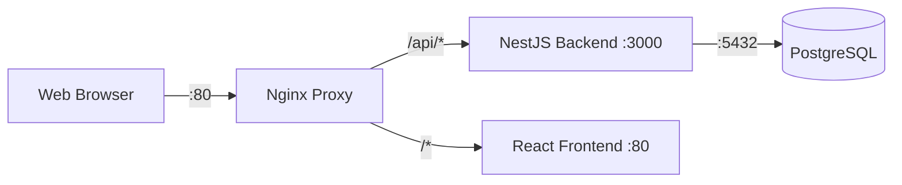

## Overview

DRAIT Mini-MES uses Docker Compose to orchestrate four services:

<CardGroup cols={2}>
  <Card title="drait-db" icon="database">
    PostgreSQL 16 database for data persistence
  </Card>
  <Card title="drait-backend" icon="server">
    NestJS API server with Prisma ORM
  </Card>
  <Card title="drait-frontend" icon="browser">
    React + Vite frontend application
  </Card>
  <Card title="drait-nginx" icon="network-wired">
    Nginx reverse proxy for routing
  </Card>
</CardGroup>

## Architecture



## Deployment Steps

<Steps>
  <Step title="Clone the repository">
    Clone the DRAIT Mini-MES repository to your server:

    <CodeGroup>
    ```bash Linux/macOS
    # Clone the repository
    git clone <repository-url>
    cd Drait-mini-MES
    ```

    ```powershell Windows
    # Clone the repository
    git clone <repository-url>
    cd Drait-mini-MES
    ```
    </CodeGroup>
  </Step>

  <Step title="Create environment file">
    Copy the example environment file and customize it:

    <CodeGroup>
    ```bash Linux/macOS
    cp .env.example .env
    ```

    ```powershell Windows
    Copy-Item .env.example .env
    ```
    </CodeGroup>

    <Warning>
      **Security Critical:** Before deploying to production, you MUST change the following values:
      - `POSTGRES_PASSWORD` - Use a strong, unique password
      - `JWT_SECRET` - Generate a random string (minimum 32 characters)
      
      See [Environment Variables](/deployment/environment-variables) for detailed configuration.
    </Warning>
  </Step>

  <Step title="Configure timezone">
    Edit the `.env` file and set your timezone:

    ```bash
    TZ=America/Buenos_Aires  # Change to your timezone
    ```

    Common timezone values:
    - `America/New_York`
    - `Europe/London`
    - `Asia/Tokyo`
    - `UTC`

    [View all timezone values](https://en.wikipedia.org/wiki/List_of_tz_database_time_zones)
  </Step>

  <Step title="Build and start services">
    Build the Docker images and start all services:

    <CodeGroup>
    ```bash Linux/macOS
    docker compose up --build -d
    ```

    ```powershell Windows
    docker compose up --build -d
    ```
    </CodeGroup>

    The `--build` flag ensures images are built from source, and `-d` runs containers in detached mode.

    <Note>
      First build may take 5-10 minutes depending on your internet connection and system performance.
    </Note>
  </Step>

  <Step title="Verify services are running">
    Check that all containers are healthy:

    ```bash
    docker compose ps
    ```

    Expected output:
    ```
    NAME              IMAGE                  STATUS
    drait-backend     drait-backend:latest   Up (healthy)
    drait-db          postgres:16-alpine     Up (healthy)
    drait-frontend    drait-frontend:latest  Up
    drait-nginx       nginx:1.27-alpine      Up
    ```

    All services should show `Up` status. Database and backend should show `(healthy)`.
  </Step>

  <Step title="Initialize database">
    Run Prisma migrations to create the database schema:

    ```bash
    docker compose exec drait-backend npm run prisma:migrate
    ```

    This command:
    - Creates all database tables
    - Sets up relationships and constraints
    - Applies any pending migrations
  </Step>

  <Step title="Seed demo data (optional)">
    Load sample data for testing and demonstration:

    ```bash
    docker compose exec drait-backend npm run prisma:seed
    ```

    This creates:
    - Demo company and users
    - Sample clients
    - Example quotations and work orders
    - Test resources and materials
    - Operation logs and material consumptions

    <Info>
      Skip this step in production environments. The seed data is intended for development and demonstration only.
    </Info>
  </Step>

  <Step title="Access the application">
    Open your browser and navigate to:

    - **Application:** `http://localhost/`
    - **API Health Check:** `http://localhost/api/health`
    - **API Status:** `http://localhost/api/auth/status`

    If you changed `HTTP_PORT` in `.env`, use that port instead (e.g., `http://localhost:8080/`).
  </Step>
</Steps>

## Demo Credentials

If you ran the seed script, use these credentials to log in:

<CardGroup cols={3}>
  <Card title="Owner/Admin" icon="user-crown">
    **Email:** `owner@drait.local`
    
    **Password:** `ChangeMe123!`
    
    Full system access including user management and audit logs
  </Card>
  
  <Card title="Supervisor" icon="user-tie">
    **Email:** `supervisor@drait.local`
    
    **Password:** `ChangeMe123!`
    
    Access to dashboard, dispatch, clients, work orders, and reports
  </Card>
  
  <Card title="Operator" icon="user-gear">
    **Email:** `oper1@drait.local`
    
    **Password:** `ChangeMe123!`
    
    Access to "My Shift" view with assigned work orders only
  </Card>
</CardGroup>

<Warning>
  **Security:** These demo accounts should be deleted or have their passwords changed before production use.
</Warning>

## Container Management

### View Logs

View logs from all services:
```bash
docker compose logs -f
```

View logs from a specific service:
```bash
# Backend logs
docker compose logs -f drait-backend

# Database logs
docker compose logs -f drait-db

# Frontend logs
docker compose logs -f drait-frontend

# Nginx logs
docker compose logs -f drait-nginx
```

### Stop Services

Stop all services (preserves data):
```bash
docker compose stop
```

### Start Stopped Services

Restart previously stopped services:
```bash
docker compose start
```

### Restart Services

Restart all services:
```bash
docker compose restart
```

Restart a specific service:
```bash
docker compose restart drait-backend
```

### Rebuild After Code Changes

If you modify the application code, rebuild and restart:

```bash
docker compose up --build -d
```

### Stop and Remove Everything

<Warning>
  **Data Loss Warning:** This command will delete all data in the database!
</Warning>

```bash
# Stop and remove containers, networks, and volumes
docker compose down -v
```

Use this to completely reset the installation. Omit `-v` to preserve database data:
```bash
# Remove containers but keep database volume
docker compose down
```

## Database Management

### Access PostgreSQL Shell

Connect to the PostgreSQL database:

```bash
docker compose exec drait-db psql -U drait -d drait_mes
```

Common PostgreSQL commands:
```sql
-- List all tables
\dt

-- Describe a table
\d "User"

-- Run a query
SELECT * FROM "User" LIMIT 10;

-- Exit
\q
```

### Backup Database

Create a backup of the database:

<CodeGroup>
```bash Linux/macOS
docker compose exec drait-db pg_dump -U drait drait_mes > backup_$(date +%Y%m%d_%H%M%S).sql
```

```powershell Windows
docker compose exec drait-db pg_dump -U drait drait_mes > backup_$(Get-Date -Format 'yyyyMMdd_HHmmss').sql
```
</CodeGroup>

### Restore Database

Restore from a backup file:

```bash
# Stop backend to prevent conflicts
docker compose stop drait-backend

# Drop and recreate database
docker compose exec drait-db psql -U drait -c "DROP DATABASE drait_mes;"
docker compose exec drait-db psql -U drait -c "CREATE DATABASE drait_mes;"

# Restore backup
cat backup_file.sql | docker compose exec -T drait-db psql -U drait -d drait_mes

# Restart backend
docker compose start drait-backend
```

## Health Checks

The deployment includes automated health checks:

### Database Health Check
- **Interval:** Every 10 seconds
- **Timeout:** 5 seconds
- **Retries:** 5 attempts
- **Test:** PostgreSQL ready check

### Backend Health Check
- **Interval:** Every 15 seconds
- **Timeout:** 5 seconds
- **Retries:** 5 attempts
- **Start Period:** 30 seconds
- **Test:** HTTP request to `/api/auth/status`

View health status:
```bash
docker compose ps
```

## Networking

### Service Communication

Services communicate on an internal Docker network:

- Frontend → Nginx (internal)
- Backend → Nginx (internal)
- Backend → Database via `drait-db:5432` (internal)
- Nginx → Host via port `80` (exposed)

### Exposed Ports

By default, only the following ports are exposed to the host:

| Container Port | Host Port | Service | Configurable Via |
|----------------|-----------|---------|------------------|
| 80 | 80 | Nginx | `HTTP_PORT` |
| 5432 | 5432 | PostgreSQL | `POSTGRES_PORT` |

<Info>
  The backend runs on port 3000 inside its container but is only accessible via Nginx proxy at `http://localhost/api/*`.
</Info>

## Troubleshooting

<AccordionGroup>
  <Accordion title="Services won't start">
    Check if ports are already in use:
    ```bash
    # Linux/macOS
    sudo lsof -i :80
    sudo lsof -i :5432
    ```

    Change ports in `.env` if needed:
    ```bash
    HTTP_PORT=8080
    POSTGRES_PORT=5433
    ```
  </Accordion>

  <Accordion title="Database connection errors">
    Ensure the database is healthy:
    ```bash
    docker compose ps drait-db
    ```

    Check database logs:
    ```bash
    docker compose logs drait-db
    ```

    Verify `DATABASE_URL` in `.env` matches your database credentials.
  </Accordion>

  <Accordion title="Backend won't start or is unhealthy">
    Check backend logs:
    ```bash
    docker compose logs drait-backend
    ```

    Common issues:
    - Database not ready (wait for health check)
    - Migration not run (`docker compose exec drait-backend npm run prisma:migrate`)
    - Invalid `DATABASE_URL` in `.env`
  </Accordion>

  <Accordion title="Frontend shows API errors">
    Verify backend is healthy:
    ```bash
    curl http://localhost/api/health
    ```

    Check Nginx configuration:
    ```bash
    docker compose logs drait-nginx
    ```

    Ensure `VITE_API_BASE_URL=/api` in `.env`.
  </Accordion>

  <Accordion title="Changes not reflected after code update">
    Rebuild the affected service:
    ```bash
    # Rebuild backend
    docker compose up --build -d drait-backend

    # Rebuild frontend
    docker compose up --build -d drait-frontend
    ```
  </Accordion>

  <Accordion title="Out of disk space">
    Clean up unused Docker resources:
    ```bash
    # Remove unused images
    docker image prune -a

    # Remove unused volumes (WARNING: may delete data)
    docker volume prune

    # Full cleanup
    docker system prune -a --volumes
    ```
  </Accordion>
</AccordionGroup>

## Production Considerations

<Warning>
  The default configuration is suitable for development and testing. For production deployments, consider the following:
</Warning>

### Security Hardening

1. **Change all default passwords** in `.env`:
   - `POSTGRES_PASSWORD`
   - `JWT_SECRET` (use a cryptographically secure random string)

2. **Remove exposed database port** in `docker-compose.yml`:
   ```yaml
   drait-db:
     # Remove or comment out:
     # ports:
     #   - "${POSTGRES_PORT}:5432"
   ```

3. **Configure CORS** appropriately:
   ```bash
   CORS_ORIGIN=https://yourdomain.com
   ```

4. **Use HTTPS** with SSL/TLS certificates (configure Nginx or use a reverse proxy like Traefik)

### Performance Optimization

1. Set `NODE_ENV=production` in `.env`
2. Configure PostgreSQL for production workloads
3. Enable Nginx caching and compression
4. Set up monitoring and logging

### Data Persistence

1. **Regular backups**: Schedule automated database backups
2. **Volume backups**: Back up the `postgres_data` Docker volume
3. **Disaster recovery**: Test restore procedures regularly

### Monitoring

1. Set up container health monitoring
2. Configure log aggregation
3. Set up alerts for service failures
4. Monitor disk usage and database performance

## Next Steps

<CardGroup cols={2}>
  <Card title="Environment Variables" icon="code" href="/deployment/environment-variables">
    Learn about all available configuration options
  </Card>
  <Card title="User Roles" icon="users" href="/concepts/roles-permissions">
    Understand the role-based access control system
  </Card>
</CardGroup>
