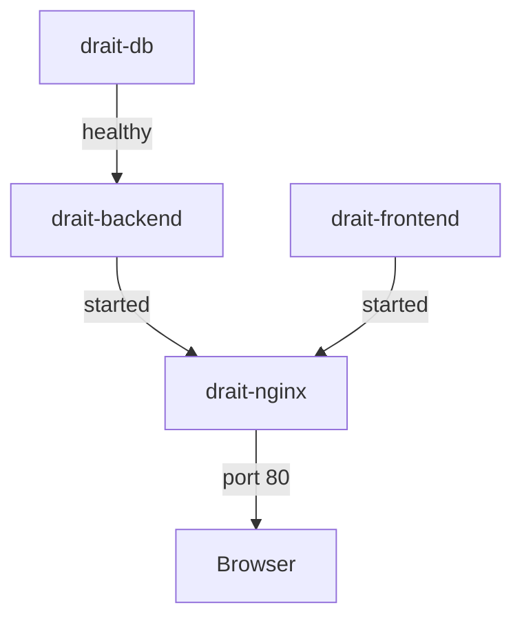

## Introduction

DRAIT Mini-MES is a modular, web-based Manufacturing Execution System designed for metalworking and fabrication shops. It provides complete traceability from client quotations through work order execution to delivery, with role-based access control and real-time operational insights.

## Architecture

### High-Level Architecture

DRAIT follows a modern three-tier architecture with containerized deployment:

```
┌─────────────────────────────────────────────────────────────┐
│                        Browser Client                        │
│                     (React 18 + TypeScript)                  │
└────────────────────────────┬────────────────────────────────┘
                             │
                             ▼
┌─────────────────────────────────────────────────────────────┐
│                    Nginx Reverse Proxy :80                   │
│  ┌─────────────────────┐    ┌──────────────────────────┐   │
│  │   /api/* routes     │───▶│  Static React Build      │   │
│  │   → Backend :3000   │    │  → Frontend Container    │   │
│  └─────────────────────┘    └──────────────────────────┘   │
└────────────────────────────┬────────────────────────────────┘
                             │
                             ▼
┌─────────────────────────────────────────────────────────────┐
│              NestJS Backend Application :3000                │
│  ┌──────────┬──────────┬──────────┬──────────────────┐     │
│  │  Auth    │ Work     │ Reports  │  11 Modules      │     │
│  │  + JWT   │ Orders   │ + KPIs   │  (REST APIs)     │     │
│  └────┬─────┴────┬─────┴────┬─────┴──────────────────┘     │
│       │          │          │                               │
│       └──────────┴──────────┴───────────────┐              │
│                                              │              │
│                                    ┌─────────▼────────┐     │
│                                    │  Prisma ORM      │     │
│                                    └─────────┬────────┘     │
└──────────────────────────────────────────────┼──────────────┘
                                               │
                                               ▼
┌─────────────────────────────────────────────────────────────┐
│                  PostgreSQL 16 Database                      │
│  - Multi-tenant data isolation by companyId                  │
│  - 14 core entities with full relational integrity           │
│  - Audit logging and operation traceability                  │
└─────────────────────────────────────────────────────────────┘
```

### Request Flow

<Steps>
  <Step title="Client Request">
    User interacts with React UI, triggering an API call via Axios
  </Step>
  
  <Step title="Nginx Routing">
    Nginx receives the request:
    - `/api/*` → Proxied to NestJS backend at `drait-backend:3000`
    - `/*` → Served from static React build in `drait-frontend:80`
  </Step>
  
  <Step title="Authentication">
    Backend validates JWT token from `Authorization: Bearer <token>` header:
    - Extracts user context: `userId`, `companyId`, `role`
    - Applies rate limiting (5 login attempts/min per IP)
    - Enforces role-based access control
  </Step>
  
  <Step title="Business Logic">
    NestJS module processes request:
    - Validates input with `class-validator`
    - Enforces multi-tenant isolation via `companyId`
    - Executes business logic with Prisma ORM
    - Creates audit logs for sensitive operations
  </Step>
  
  <Step title="Database Transaction">
    Prisma performs database operations:
    - Queries filtered by `companyId` for data isolation
    - Maintains referential integrity across entities
    - Returns strongly-typed TypeScript objects
  </Step>
  
  <Step title="Response">
    Backend returns JSON response → Nginx → React UI
    - TanStack Query caches response and manages state
    - UI updates reactively with optimistic updates
  </Step>
</Steps>

## Technology Stack

### Frontend Stack

<CardGroup cols={2}>
  <Card title="React 18" icon="react">
    Modern React with hooks, concurrent features, and automatic batching
  </Card>
  
  <Card title="TypeScript" icon="code">
    Full type safety across the entire frontend codebase
  </Card>
  
  <Card title="Vite" icon="bolt">
    Lightning-fast build tool with HMR for optimal DX
  </Card>
  
  <Card title="React Router v6" icon="route">
    Client-side routing with protected route guards
  </Card>
  
  <Card title="TanStack Query v5" icon="database">
    Powerful async state management with caching and synchronization
  </Card>
  
  <Card title="Recharts 2" icon="chart-line">
    Composable charting library for dashboard visualizations
  </Card>
  
  <Card title="Tailwind CSS" icon="paintbrush">
    Utility-first styling with custom design system
  </Card>
  
  <Card title="Axios" icon="network-wired">
    HTTP client with interceptors for auth and error handling
  </Card>
</CardGroup>

**Frontend Dependencies** (from `apps/frontend/package.json`):
```json
{
  "@tanstack/react-query": "^5.66.0",
  "axios": "^1.7.9",
  "react": "^18.3.1",
  "react-router-dom": "^6.30.0",
  "recharts": "^3.8.0",
  "lucide-react": "^0.511.0"
}
```

### Backend Stack

<CardGroup cols={2}>
  <Card title="NestJS 10" icon="node">
    Progressive Node.js framework with dependency injection and modularity
  </Card>
  
  <Card title="Prisma 5" icon="database">
    Next-generation ORM with type-safe database access
  </Card>
  
  <Card title="JWT Authentication" icon="shield-check">
    Stateless authentication with configurable expiration
  </Card>
  
  <Card title="bcrypt" icon="lock">
    Secure password hashing with salt rounds
  </Card>
  
  <Card title="@nestjs/throttler" icon="gauge">
    Rate limiting to prevent brute-force attacks
  </Card>
  
  <Card title="class-validator" icon="check-circle">
    Declarative validation using decorators
  </Card>
</CardGroup>

**Backend Dependencies** (from `apps/backend/package.json`):
```json
{
  "@nestjs/core": "^10.4.15",
  "@nestjs/jwt": "^10.2.0",
  "@nestjs/passport": "^10.0.3",
  "@nestjs/throttler": "^6.5.0",
  "@prisma/client": "^5.22.0",
  "bcrypt": "^5.1.1",
  "passport-jwt": "^4.0.1"
}
```

### Infrastructure

- **PostgreSQL 16**: Production-grade relational database with ACID compliance
- **Docker**: Containerization for consistent deployment
- **Docker Compose**: Multi-container orchestration with health checks
- **Nginx 1.27**: High-performance reverse proxy and static file server

## Core Modules

### Backend Modules

The backend is organized into 11 focused modules under `apps/backend/src/modules/`:

| Module | Purpose | Key Endpoints |
|--------|---------|---------------|
| **auth** | JWT authentication, login, session | `POST /api/auth/login`<br/>`GET /api/auth/me`<br/>`POST /api/auth/logout` |
| **users** | User management, roles, activation | `GET /api/users`<br/>`POST /api/users`<br/>`PATCH /api/users/:id/role` |
| **clients** | Customer records and contact info | `GET /api/clients`<br/>`POST /api/clients`<br/>`PATCH /api/clients/:id` |
| **quotations** | Estimates with line items | `GET /api/quotations`<br/>`POST /api/quotations`<br/>`PATCH /api/quotations/:id/status` |
| **work-orders** | Core production orders, events, assignments | `GET /api/work-orders`<br/>`POST /api/work-orders`<br/>`POST /api/work-orders/:id/events` |
| **resources** | Machines and personnel | `GET /api/resources`<br/>`POST /api/resources` |
| **materials** | Inventory, stock, movements | `GET /api/materials`<br/>`POST /api/materials/:id/adjust-stock` |
| **operation-logs** | Operational traceability | `GET /api/operation-logs/work-order/:id` |
| **reports** | KPIs, productivity, dashboards | `GET /api/reports/dashboard`<br/>`GET /api/reports/productivity` |
| **audit** | System-wide audit trail | `GET /api/audit-logs` |
| **companies** | Multi-tenant company management | (Internal use) |

### Frontend Features

The frontend is organized into feature modules under `apps/frontend/src/features/`:

| Feature | Description | Access |
|---------|-------------|--------|
| **auth** | Login, protected routes, session management | All users |
| **dashboard** | Executive KPIs, charts with Recharts, filters | SUPERVISOR, DUENO, ADMIN |
| **supervisor** | Dispatch center for work order orchestration | SUPERVISOR, DUENO, ADMIN |
| **operator** | "My Shift" view with assigned work orders only | All users |
| **work-orders** | Full work order CRUD, status changes, events | SUPERVISOR, DUENO, ADMIN |
| **clients** | Customer management | SUPERVISOR, DUENO, ADMIN |
| **quotations** | Quote creation and conversion to work orders | SUPERVISOR, DUENO, ADMIN |
| **resources** | Machine and personnel assignment | SUPERVISOR, DUENO, ADMIN |
| **materials** | Inventory management, stock adjustments | SUPERVISOR, DUENO, ADMIN |
| **reports** | Productivity reports and analytics | SUPERVISOR, DUENO, ADMIN |
| **users** | User administration, role management | DUENO, ADMIN |
| **audit** | System audit log viewer | DUENO, ADMIN |

## Data Model

### Entity Relationship Overview

```
Company (Tenant)
├── Users (OPERARIO, SUPERVISOR, DUENO, ADMIN)
├── Clients
│   ├── Quotations
│   │   └── QuotationItems
│   └── WorkOrders
│       ├── WorkOrderAssignments → Resources
│       ├── OperationLogs
│       └── MaterialConsumptions → Materials
├── Resources (HUMANO, MAQUINA)
├── Materials
│   └── MaterialMovements
└── AuditLogs
```

### Key Entities

All entities are defined in `apps/backend/prisma/schema.prisma`:

<AccordionGroup>
  <Accordion title="Company - Multi-tenant Isolation">
    ```prisma
    model Company {
      id          String     @id @default(cuid())
      name        String
      legalName   String?
      taxId       String?
      settings    Json?
      isActive    Boolean    @default(true)
      createdAt   DateTime   @default(now())
      updatedAt   DateTime   @updatedAt
      
      // All data isolated by companyId
      users       User[]
      clients     Client[]
      quotations  Quotation[]
      workOrders  WorkOrder[]
      resources   Resource[]
      materials   Material[]
      auditLogs   AuditLog[]
    }
    ```
    
    Every user, work order, and piece of data belongs to exactly one company, ensuring complete data isolation.
  </Accordion>

  <Accordion title="User - Authentication & Authorization">
    ```prisma
    enum UserRole {
      DUENO      // Owner with full access
      SUPERVISOR // Supervises operations
      OPERARIO   // Plant operator
      ADMIN      // Technical admin
    }

    model User {
      id           String   @id @default(cuid())
      companyId    String
      email        String
      fullName     String
      passwordHash String   // bcrypt hashed
      role         UserRole
      isActive     Boolean  @default(true)
      createdAt    DateTime @default(now())
      updatedAt    DateTime @updatedAt
      
      @@unique([companyId, email])
    }
    ```
    
    JWT tokens contain: `{ sub, email, role, companyId, fullName }`
  </Accordion>

  <Accordion title="WorkOrder - Core Production Entity">
    ```prisma
    enum WorkOrderStatus {
      PENDIENTE     // Pending
      PLANIFICADA   // Planned
      EN_PROCESO    // In progress
      PAUSADA       // Paused
      FINALIZADA    // Finished
      ENTREGADA     // Delivered
      CANCELADA     // Canceled
      RETRABAJO     // Rework
    }

    model WorkOrder {
      id                String            @id @default(cuid())
      companyId         String
      clientId          String
      quotationId       String?           // Optional link to quotation
      code              String            // OT-2026-001
      title             String
      description       String
      status            WorkOrderStatus   @default(PENDIENTE)
      priority          Int               @default(3)  // 1=high, 5=low
      
      // Dates
      plannedDate       DateTime?
      commitmentDate    DateTime?
      startedAt         DateTime?
      finishedAt        DateTime?
      deliveredAt       DateTime?
      
      // Estimates
      estimatedTimeMin  Int
      estimatedCost     Decimal
      
      // Relationships
      assignments       WorkOrderAssignment[]
      operationLogs     OperationLog[]
      materialConsumptions MaterialConsumption[]
      
      @@unique([companyId, code])
    }
    ```
  </Accordion>

  <Accordion title="Resource - Machines & Personnel">
    ```prisma
    enum ResourceType {
      HUMANO   // Person
      MAQUINA  // Machine/equipment
    }

    enum ResourceStatus {
      DISPONIBLE     // Available
      OCUPADO        // Busy
      MANTENIMIENTO  // Under maintenance
      FUERA_DE_LINEA // Offline
    }

    model Resource {
      id          String         @id @default(cuid())
      companyId   String
      type        ResourceType
      name        String
      sector      String?
      status      ResourceStatus @default(DISPONIBLE)
      isActive    Boolean        @default(true)
      
      assignments WorkOrderAssignment[]
    }
    ```
  </Accordion>

  <Accordion title="Material - Inventory Management">
    ```prisma
    model Material {
      id           String   @id @default(cuid())
      companyId    String
      name         String
      category     String?
      unit         String   // kg, m, unidad, etc.
      unitCost     Decimal
      stock        Decimal  @default(0)
      isActive     Boolean  @default(true)
      
      consumptions MaterialConsumption[]
      movements    MaterialMovement[]
    }

    enum MaterialMovementType {
      ENTRADA   // Stock entry
      AJUSTE    // Manual adjustment
      CONSUMO   // Consumption
    }
    ```
  </Accordion>

  <Accordion title="OperationLog - Traceability">
    ```prisma
    enum OperationEventType {
      OT_CREADA          // Work order created
      ASIGNADO           // Resource assigned
      INICIO             // Started
      PAUSA              // Paused
      REANUDACION        // Resumed
      FINALIZACION       // Completed
      CAMBIO_ESTADO      // Status change
      MATERIAL_CONSUMIDO // Material consumed
      NOTA               // Free-form note
    }

    model OperationLog {
      id          String             @id @default(cuid())
      companyId   String
      workOrderId String
      resourceId  String?
      userId      String?
      eventType   OperationEventType
      eventAt     DateTime
      pauseReason String?
      note        String?
    }
    ```
  </Accordion>

  <Accordion title="AuditLog - System Audit Trail">
    ```prisma
    enum AuditEntityType {
      COMPANY | USER | CLIENT | QUOTATION | WORK_ORDER |
      RESOURCE | MATERIAL | AUTH
    }

    enum AuditActionType {
      CREATE | UPDATE | DELETE | STATUS_CHANGE | ASSIGN |
      DELIVERY_CLOSE | PASSWORD_CHANGE | ROLE_CHANGE |
      SETTINGS_CHANGE | LOGIN
    }

    model AuditLog {
      id         String          @id @default(cuid())
      companyId  String
      userId     String?
      entityType AuditEntityType
      entityId   String
      action     AuditActionType
      before     Json?           // State before change
      after      Json?           // State after change
      metadata   Json?
      createdAt  DateTime        @default(now())
    }
    ```
  </Accordion>
</AccordionGroup>

## Security Architecture

### Authentication Flow

<Steps>
  <Step title="User Login">
    Client submits credentials to `POST /api/auth/login`
    
    - Rate limited to **5 attempts per minute per IP** via `@nestjs/throttler`
    - Password validated with bcrypt against hashed password in database
  </Step>
  
  <Step title="JWT Generation">
    Backend generates signed JWT with payload:
    
    ```json
    {
      "sub": "user-uuid",
      "email": "user@company.com",
      "role": "SUPERVISOR",
      "companyId": "company-uuid",
      "fullName": "John Doe"
    }
    ```
    
    Token signed with `JWT_SECRET` from environment, expires per `JWT_EXPIRES_IN` (default: 8h)
  </Step>
  
  <Step title="Client Storage">
    Frontend stores token in `localStorage` under key `drait.session`:
    
    ```typescript
    {
      token: "eyJhbGciOiJIUzI1NiIsInR5cCI6IkpXVCJ9...",
      user: { id, email, role, fullName, companyId }
    }
    ```
  </Step>
  
  <Step title="Authenticated Requests">
    Every API request includes header:
    
    ```
    Authorization: Bearer <jwt_token>
    ```
    
    Axios interceptor (`apps/frontend/src/shared/api/`) automatically adds header from localStorage
  </Step>
  
  <Step title="Server Validation">
    `JwtAuthGuard` validates token on every protected endpoint:
    
    - Verifies signature with `JWT_SECRET`
    - Checks expiration
    - Extracts user context and attaches to request
    - Returns 401 Unauthorized if invalid
  </Step>
  
  <Step title="Role Authorization">
    Custom `@Roles()` decorator enforces access:
    
    ```typescript
    @Roles(UserRole.DUENO, UserRole.ADMIN)
    @Get('users')
    findAll() { ... }
    ```
    
    Returns 403 Forbidden if user lacks required role
  </Step>
</Steps>

### Security Features

- **Password Hashing**: bcrypt with automatic salt generation
- **Rate Limiting**: Brute-force protection on login endpoint
- **JWT Expiration**: Configurable token lifetime
- **Multi-tenant Isolation**: All queries filtered by `companyId`
- **Role-based Access Control**: Four roles with granular permissions
- **Audit Logging**: Automatic tracking of sensitive operations
- **Environment Validation**: Rejects weak `JWT_SECRET` in production

<Warning>
  **Production Security Checklist**:
  
  - Set `JWT_SECRET` to random string ≥32 characters
  - Use strong database passwords
  - Enable HTTPS with SSL/TLS certificates
  - Configure `CORS_ORIGIN` to specific domains
  - Set `NODE_ENV=production`
  - Implement refresh token rotation (planned Phase 2)
  - Regular security audits and dependency updates
</Warning>

## Docker Configuration

### Service Architecture

Defined in `docker-compose.yml`:

```yaml
services:
  drait-db:          # PostgreSQL 16
  drait-backend:     # NestJS API
  drait-frontend:    # React static build
  drait-nginx:       # Reverse proxy
```

<Tabs>
  <Tab title="Database Service">
    ```yaml
    drait-db:
      image: postgres:16-alpine
      container_name: drait-db
      restart: unless-stopped
      environment:
        POSTGRES_DB: ${POSTGRES_DB}
        POSTGRES_USER: ${POSTGRES_USER}
        POSTGRES_PASSWORD: ${POSTGRES_PASSWORD}
      volumes:
        - postgres_data:/var/lib/postgresql/data
      ports:
        - "${POSTGRES_PORT}:5432"
      healthcheck:
        test: ["CMD-SHELL", "pg_isready -U ${POSTGRES_USER}"]
        interval: 10s
        timeout: 5s
        retries: 5
    ```
    
    **Features**:
    - Alpine Linux for minimal image size
    - Health checks ensure readiness before backend starts
    - Persistent volume for data durability
    - Exposed port for direct access (dev/debugging)
  </Tab>
  
  <Tab title="Backend Service">
    ```yaml
    drait-backend:
      build:
        context: ./apps/backend
        dockerfile: Dockerfile
      container_name: drait-backend
      restart: unless-stopped
      depends_on:
        drait-db:
          condition: service_healthy
      environment:
        NODE_ENV: ${NODE_ENV}
        DATABASE_URL: ${DATABASE_URL}
        JWT_SECRET: ${JWT_SECRET}
        JWT_EXPIRES_IN: ${JWT_EXPIRES_IN}
      healthcheck:
        test: ["CMD-SHELL", "node -e \"...\""]  
        interval: 15s
    ```
    
    **Features**:
    - Waits for database health check before starting
    - Custom health check on `/api/auth/status`
    - Environment variables injected from `.env`
  </Tab>
  
  <Tab title="Nginx Service">
    ```yaml
    drait-nginx:
      image: nginx:1.27-alpine
      container_name: drait-nginx
      restart: unless-stopped
      depends_on:
        - drait-backend
        - drait-frontend
      ports:
        - "${HTTP_PORT}:80"
      volumes:
        - ./infra/nginx/default.conf:/etc/nginx/conf.d/default.conf:ro
    ```
    
    **Routing** (`infra/nginx/default.conf`):
    ```nginx
    location /api/ {
      proxy_pass http://drait-backend:3000/api/;
      proxy_set_header Host $host;
      proxy_set_header X-Real-IP $remote_addr;
    }

    location / {
      proxy_pass http://drait-frontend:80;
    }
    ```
  </Tab>
</Tabs>

### Health Checks & Dependencies



Docker Compose ensures services start in correct order with health validation.

## Data Flow Examples

### Creating a Work Order from Quotation

<Steps>
  <Step title="User Action">
    Supervisor clicks "Convert to Work Order" on approved quotation in React UI
  </Step>
  
  <Step title="API Request">
    ```typescript
    POST /api/work-orders/from-quotation/:quotationId
    Authorization: Bearer <jwt>
    Content-Type: application/json

    {
      "plannedDate": "2026-04-01T08:00:00Z",
      "priority": 2
    }
    ```
  </Step>
  
  <Step title="Backend Processing">
    ```typescript
    // apps/backend/src/modules/work-orders/work-orders.service.ts
    async createFromQuotation(quotationId: string, dto: CreateFromQuotationDto) {
      // 1. Fetch quotation with items
      const quotation = await this.prisma.quotation.findUnique({
        where: { id: quotationId },
        include: { items: true, client: true }
      });
      
      // 2. Generate unique code
      const code = await this.generateWorkOrderCode();
      
      // 3. Create work order in transaction
      const workOrder = await this.prisma.workOrder.create({
        data: {
          companyId: quotation.companyId,
          clientId: quotation.clientId,
          quotationId: quotation.id,
          code,
          title: quotation.title,
          description: quotation.description,
          estimatedTimeMin: quotation.estimatedTimeMin,
          estimatedCost: quotation.estimatedCost,
          status: 'PLANIFICADA',
          priority: dto.priority,
          plannedDate: dto.plannedDate
        }
      });
      
      // 4. Create audit log
      await this.auditService.log({
        entityType: 'WORK_ORDER',
        entityId: workOrder.id,
        action: 'CREATE',
        after: workOrder
      });
      
      return workOrder;
    }
    ```
  </Step>
  
  <Step title="Response">
    Backend returns created work order with status 201
  </Step>
  
  <Step title="UI Update">
    TanStack Query invalidates cache and refetches work orders list, UI updates automatically
  </Step>
</Steps>

### Recording Material Consumption

<Steps>
  <Step title="Operator Logs Consumption">
    Operator enters material consumption in "My Shift" view
  </Step>
  
  <Step title="API Call">
    ```typescript
    POST /api/work-orders/:workOrderId/consumptions
    
    {
      "materialId": "mat_xyz",
      "quantity": 5.5,
      "note": "Used for welding frame"
    }
    ```
  </Step>
  
  <Step title="Backend Transaction">
    ```typescript
    // Atomic transaction:
    await this.prisma.$transaction(async (tx) => {
      // 1. Get material current cost
      const material = await tx.material.findUnique({ 
        where: { id: dto.materialId } 
      });
      
      // 2. Create consumption record
      const consumption = await tx.materialConsumption.create({
        data: {
          workOrderId,
          materialId: dto.materialId,
          quantity: dto.quantity,
          unitCostSnapshot: material.unitCost,  // Freeze cost
          createdByUserId: currentUser.id,
          note: dto.note
        }
      });
      
      // 3. Reduce material stock
      await tx.material.update({
        where: { id: dto.materialId },
        data: { stock: { decrement: dto.quantity } }
      });
      
      // 4. Create material movement
      await tx.materialMovement.create({
        data: {
          materialId: dto.materialId,
          type: 'CONSUMO',
          quantity: -dto.quantity,
          unitCost: material.unitCost
        }
      });
      
      // 5. Log operation
      await tx.operationLog.create({
        data: {
          workOrderId,
          userId: currentUser.id,
          eventType: 'MATERIAL_CONSUMIDO',
          eventAt: new Date(),
          note: `${dto.quantity} ${material.unit} of ${material.name}`
        }
      });
    });
    ```
    
    All-or-nothing transaction ensures data consistency
  </Step>
</Steps>

## Performance Considerations

### Database Indexing

Strategic indexes in `schema.prisma` optimize common queries:

```prisma
@@index([companyId, status])          // Work orders by tenant + status
@@index([companyId, commitmentDate])  // Due date queries
@@index([companyId, workOrderId, eventAt])  // Operation log timeline
@@index([companyId, createdAt])       // Audit log chronological
```

### Frontend Optimization

- **TanStack Query**: Automatic request deduplication and caching
- **Code Splitting**: React Router lazy-loads feature modules
- **Optimistic Updates**: UI updates before server confirmation
- **Debounced Search**: Reduces API calls on user input

### Backend Optimization

- **Prisma Select**: Only fetch required fields
- **Connection Pooling**: PostgreSQL connection reuse
- **Pagination**: Limit result sets with `take` and `skip`
- **Throttling**: Rate limiting prevents resource exhaustion

## Monitoring & Observability

### Health Endpoints

```bash
# Backend health
curl http://localhost/api/health

# Database connectivity
curl http://localhost/api/auth/status
```

### Logging

- **Application Logs**: NestJS built-in logger
- **Operation Logs**: In-database traceability (`OperationLog`)
- **Audit Logs**: Change tracking for compliance (`AuditLog`)

```bash
# View logs
docker compose logs -f backend
docker compose logs -f drait-db
```

## Extensibility

DRAIT is designed for easy extension:

### Adding a New Entity

1. **Define schema** in `apps/backend/prisma/schema.prisma`
2. **Run migration**: `npx prisma migrate dev --name add_entity`
3. **Generate NestJS module**: `nest g resource entity`
4. **Create frontend feature**: Add to `apps/frontend/src/features/`
5. **Update navigation**: Add route and menu item

### Planned Enhancements (Phase 2)

- Refresh token rotation for enhanced security
- PDF/Excel report exports
- Visual resource scheduling (Gantt chart)
- Email/WhatsApp alerts for delays and low stock
- Advanced field-level audit trail
- Multi-tenant branding and strong isolation

## Next Steps

<CardGroup cols={3}>
  <Card title="API Reference" icon="book" href="/api/overview">
    Detailed endpoint documentation
  </Card>
  
  <Card title="Deployment Guide" icon="server" href="/deployment">
    Production deployment best practices
  </Card>
  
  <Card title="Development" icon="code" href="/deployment/docker-setup">
    Local development setup
  </Card>
</CardGroup>